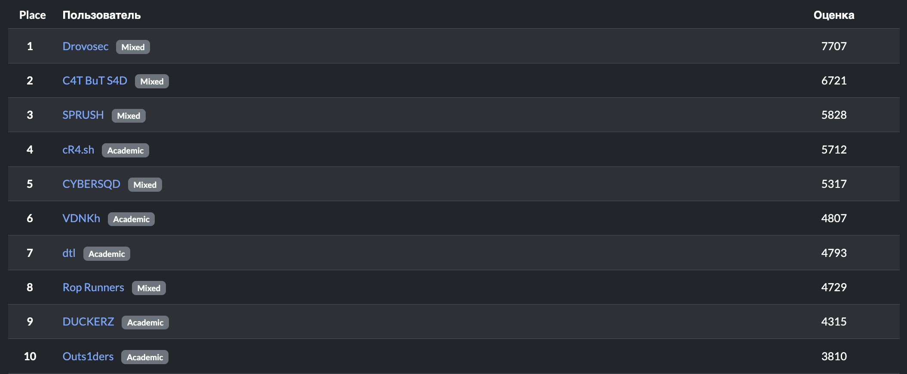

# Отборочный этап IX Кубка CTF России

Исходные коды, разборы, эксплоиты и файлы для деплоя заданий с отборочного тура IX Кубка CTF России, который проходил 2-3 ноября 2025 года в онлайн-формате.

[Сайт соревнований](https://ctfcup.ru/)

Официальный партнер - Газпромбанк, Сбер

Технологические партнеры - Yandex Cloud, cloud.ru, НТЦ Вулкац, Edge, Цинтера, КЦ доменов ru/рф

Партнеры - Газинформ, Третье тысячелетие

Партнеры призового фонда - ГК Гарда, Сёрчинформ

Информационный партнер - Информагентство ТАСС, журнал Хакер

При поддержке "Движение первых"

 Таск                                                                                      | Категория | Баллы | Кол-во решений | Автор |
| ---------------------------------------------------------------------------------------- | --------- | ----- | -------------- | ----- |
| [miracle](tasks/crypto/miracle/Readme.md)                                                | crypto    | 100   | 80             | @al5c2rd   |
| [cursed](tasks/crypto/cursed/Readme.md)                                                  | crypto    | 395   | 42             | @al5c2rd   |
| [annabelle](tasks/reverse/annabelle/Readme.md)                                           | reverse   | 793   | 25             | @al5c2rd   |
| [nanomachines](tasks/reverse/nanomachines/Readme.md)                                     | reverse   | 1000  | 1              | @al5c2rd   |
| [Wincrack](tasks/reverse/Wincrack/README.md)                                             | reverse   | 919   | 16             | @revker    |
| [bad parser](tasks/pwn/bad_parser/README.md)                                             | pwn       | 997   | 4              | @revker    |
| [play with ker](tasks/pwn/play_with_ker/README.md)                                       | pwn       | 995   | 5              | @revker    |
| [safelang](tasks/pwn/safelang/Readme.md)                                                 | pwn       | 100   | 156            | @al5c2rd   |
| [safelang-revenge](tasks/pwn/safelang-revenge/Readme.md)                                 | pwn       | 100   | 108            | @al5c2rd   |
| [safelang-revenge-revenge](tasks/pwn/safelang-revenge-revenge/Readme.md)                 | pwn       | 100   | 70             | @al5c2rd   |
| [goose](tasks/web/goose/Readme.md)                                                       | web       | 100   | 215            | @al5c2rd   |
| [goose-revenge](tasks/web/goose-revenge/Readme.md)                                       | web       | 100   | 96             | @al5c2rd   |
| [trustmebroker](tasks/web/trustmebroker/README.md)                                       | web       | 983   | 8              | @nime_boy  |
| [BimboIncident](tasks/forensic/BimboIncident/README.md)                                  | forensics | 1000  | 1              | @revker    |
| [brokilon](tasks/forensic/brokilon/README.md)                                            | forensics | 983   | 8              | @revker    |
| [Funeral](tasks/forensic/Funeral/README.md)                                              | forensics | 239   | 47             | @revker    |
| [babyrev](tasks/beginners/babyrev/README.md)                                             | beginners | 100   | 173            | @revker    |
| [babypwn](tasks/beginners/babypwn/README.md)                                             | beginners | 100   | 143            | @revker    |
| [babymisc](tasks/beginners/babymisc/README.md)                                           | beginners | 100   | 408            | @revker    |
| [babyfor](tasks/beginners/babyfor/README.md)                                             | beginners | 100   | 201            | @revker    |
| [babycrypto](tasks/beginners/babycrypto/README.md)                                       | beginners | 100   | 435            | @revker    |
| [babyppc](tasks/beginners/geo/README.md)                                                 | beginners | 100   | 344            | @al5c2rd   |
| [babyosint](tasks/beginners/babyosint/README.md)                                         | beginners | 100   | 402            | @by_sm     |
| [babyweb](tasks/beginners/babyweb/README.md)                                             | beginners | 100   | 106            | @by_sm     |

## Результаты

[Полный список](scoreboard/full.png)

## Инфраструктура

Инфраструктура была предоставлена компаниями yandex.cloud / cloud.ru

- DevOps: [@devijoe](https://github.com/DeviJoe)
- Checksystem: [CTFd](https://ctfd.io)
