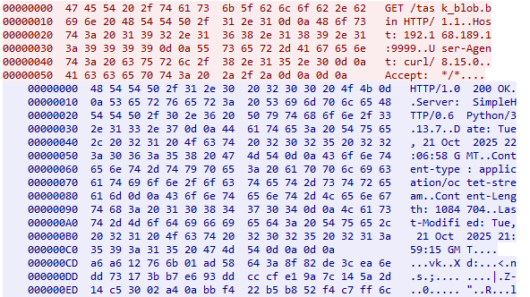
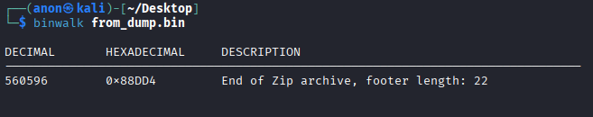
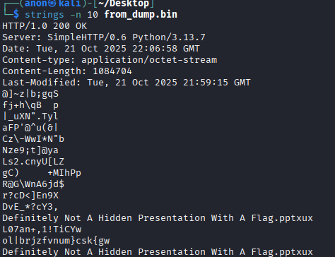
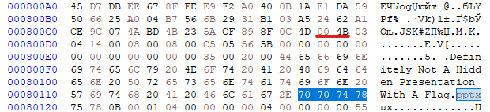

# Анализ трафика

Нам дан дамп трафика, откроем его в Wireshark и посмотрим стримы.

Почти в самом начале находим HTTP-стрим со скачиванием файла.

Достаём этот файл из трафика и начинаем его анализ

# Анализ бинарного блоба

Начинаем с утилиты `binwalk` и видим там интересную строку которая укзывает на наличие ZIP-архива в этом бинарном мессиве.

Попробуем посмотреть строчки с длиной больше 10.

Видим название презентации и поищем его в файле.

Видим что-то очень похожее на начло ZIP-архива, но с пропущенным первым байтом 'P'. Подставим его и найдём конец архива (его можно увидеть в выводе `binwalk`)

Получаем ZIP-архив и распаковываем его.

# Анализ содержимого ZIP-архива

Распаковав архив находим там презентацию. Здесь можно использовать два подхода к решению:

1. Понять что второй слайд в архиве это обрезанная картинка и нажать кнопку "обрезать" и увидеть там флаг
2. Распаковать презентацию как ZIP-архив и найти там картинку с флагом

