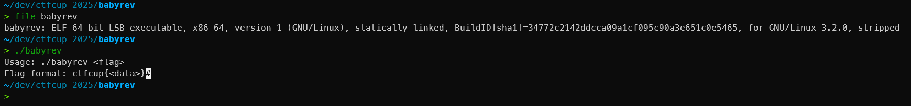
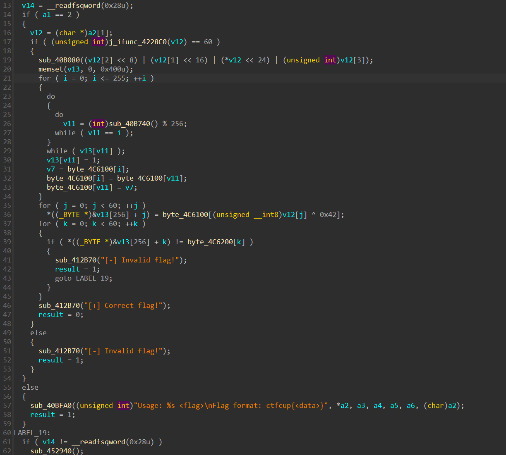
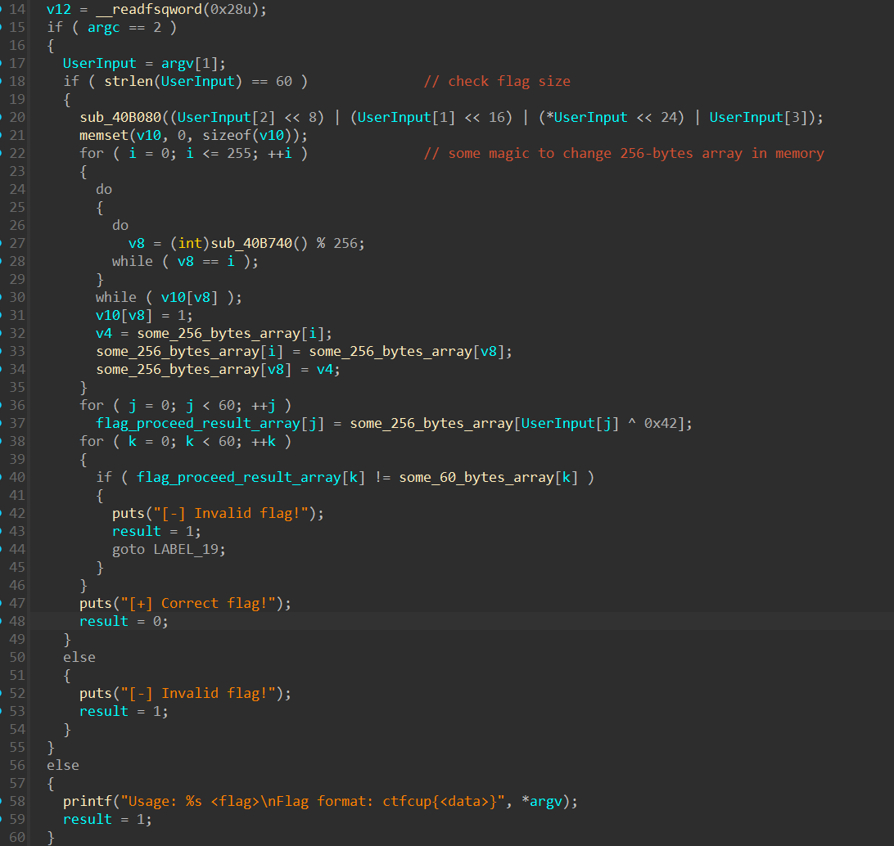
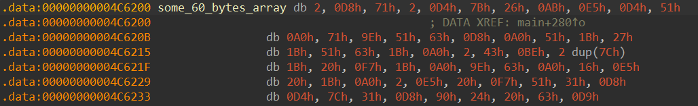
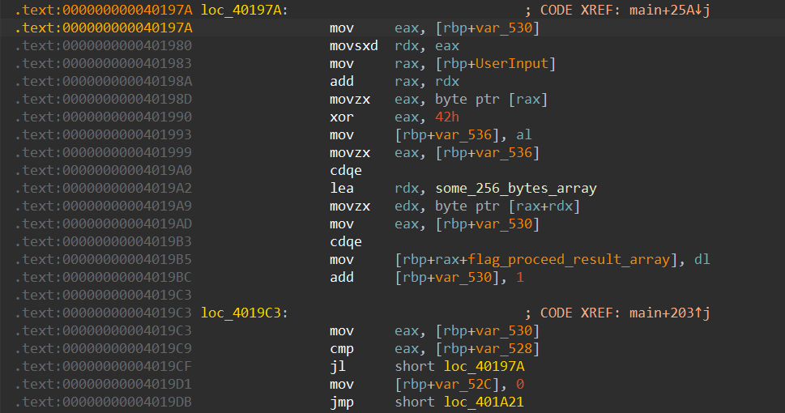
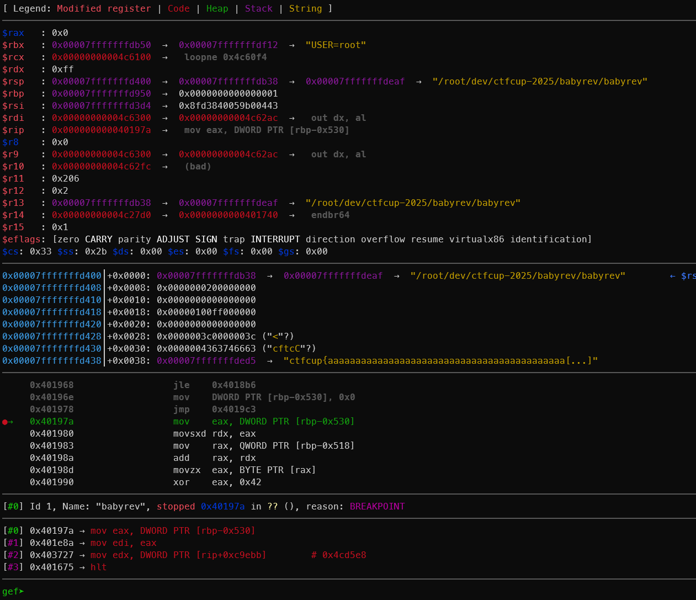
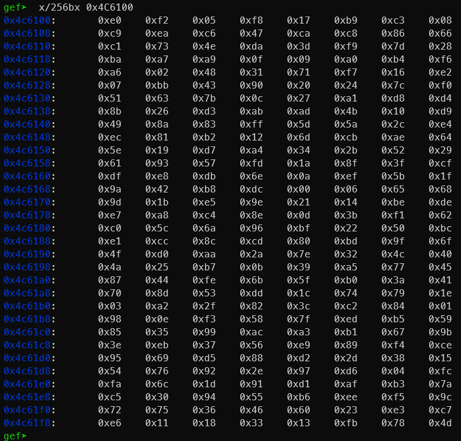

# Статический анализ в IDA PRO

Перед нами некоторый исполняемый файл под Linux, скомпилированный статически без отладочной информации.

Мы знаем, что он принимает на вход флаг и проверяет его корректность.

Загрузим его в IDA PRO и начнём анализ кода.

Логики в функции `main` не так много и сразу видны использования каких-то глобальных массивов и ряда функций.

Немного подкорректируем вывод проставив типы и проименовав переменные.

Видим размер нашего флага, а также какие-то преобразования над массивами в памяти.

Но нас инетересует как движется введённый нами флаг. Это можно отследить по переменной `UserInput`.

Как видим она используется в обращении к массиву `some_256_bytes_array` как индекс, но перед этим значение ещё XOR-ится с константной 0x42 (строка 37 на скриншоте).

После чего мы достаём из массива по этому индексу значение и складываем в массив `flag_proceed_result_array` которые потом будет сравниваться с другим массивом в памяти.

Таким образом нам надо понять с чем сравнивается наш массив. Это можно сделать просто перейдя по переменной `some_60_bytes_array`

Отлично, мы знаем как выглядит наш преобразованный корректный флаг. Осталось понять что находится в массиве `some_256_bytes_array`
Изначально в нём уже содержатся какие-то значения, но по коду мы видим, что с ними просходят какие-то преоборазовния. 

Здесь есть два варианта - понять какие преобразования происходят статически анализом или сдампить итоговый преоборазованный массив в динамике с помощью отладчика.

Более быстрый и простой способ это использовать отладчик

# Отладка и дамп массива из памяти

Запустим наш бинарь под отладчиком `gdb`.

Надём нужное место в бинаре где уже произошло преобразование нашего массива и начинается код который достаёт по индексу значения.

Запустим в отладку наш бинарь указав правильный формат флага и длину флага

`run ctfcup{aaaaaaaaaaaaaaaaaaaaaaaaaaaaaaaaaaaaaaaaaaaaaaaaaaaa}`

Смотрим где мы остановились в отладчике.

Теперь смотрим на наш массив в памяти, т.к. его адрес мы тоже знаем и можем найти в IDA PRO.

Отлично, теперь скопируем эти байты и напишем обратный код к нашему алгоритму

# Написание скрипта для решения

Нам нужно использовать наш массив на 256 байт полученный из дампа памяти во время отладки и статический массив на 60 байт из бинаря.

Мы проходимся по каждому элементу массива на 60 байт и ишем его индекс в массиве на 256 байт.
После того как мы нашли его индекс мы XOR-им его с константой 0x42 и это является символом нашего флага.

[скрипт получения флага](./solver.py)
