# Начальный анализ

Нам дан дамп оперативной памяти и некоторые указания что произошло.
Целью является расшифровка файла `MyDream.png` который лежит в директории `C:\Users\Snezhana\Documents`.
В это же директории можно найти файл `REAMDE.txt` в котором лежит сообщение:

```
Send 1 BTC to ZmFrZV9hZGRyZXNfanVzdF9zb2x2ZV90aGVfdGFzaw to get back your Birking bag!
Your encryption id: WJA^LEJEIEHREVARE
```

А также файл `1.exe` который видимо и является шифровальщиком, но он тоже был зашифрован.

Начнём анализ дампа с помощью `volatilityframework` и посмотрим процессы командой `python vol.py -f <image> windows.pslist`

<details>
<summary>PsList</summary>
    
```
PID     PPID    ImageFileName   Offset(V)       Threads Handles SessionId       Wow64   CreateTime      ExitTime        File output
4       0       System  0xcd04fa086040  135     -       N/A     False   2025-10-03 06:45:47.000000 UTC  N/A     Disabled
92      4       Registry        0xcd04fa0d5080  4       -       N/A     False   2025-10-03 06:45:36.000000 UTC  N/A     Disabled
304     4       smss.exe        0xcd04faf53040  4       -       N/A     False   2025-10-03 06:45:47.000000 UTC  N/A     Disabled
416     404     csrss.exe       0xcd04fb998140  12      -       0       False   2025-10-03 06:45:49.000000 UTC  N/A     Disabled
488     404     wininit.exe     0xcd04fe1960c0  5       -       0       False   2025-10-03 06:45:49.000000 UTC  N/A     Disabled
496     480     csrss.exe       0xcd04fe221140  13      -       1       False   2025-10-03 06:45:49.000000 UTC  N/A     Disabled
576     480     winlogon.exe    0xcd04fe288080  7       -       1       False   2025-10-03 06:45:49.000000 UTC  N/A     Disabled
632     488     services.exe    0xcd04fe2c4080  9       -       0       False   2025-10-03 06:45:49.000000 UTC  N/A     Disabled
648     488     lsass.exe       0xcd04fe2f5080  13      -       0       False   2025-10-03 06:45:49.000000 UTC  N/A     Disabled
752     632     svchost.exe     0xcd04fe35f240  26      -       0       False   2025-10-03 06:45:49.000000 UTC  N/A     Disabled
768     488     fontdrvhost.ex  0xcd04fe35d0c0  6       -       0       False   2025-10-03 06:45:49.000000 UTC  N/A     Disabled
776     576     fontdrvhost.ex  0xcd04fe361140  6       -       1       False   2025-10-03 06:45:49.000000 UTC  N/A     Disabled
884     632     svchost.exe     0xcd04fa9de080  15      -       0       False   2025-10-03 06:45:49.000000 UTC  N/A     Disabled
968     576     dwm.exe 0xcd04fea06080  22      -       1       False   2025-10-03 06:45:49.000000 UTC  N/A     Disabled
976     576     LogonUI.exe     0xcd04fea08080  0       -       1       False   2025-10-03 06:45:49.000000 UTC  2025-10-03 06:46:14.000000 UTC  Disabled
396     632     svchost.exe     0xcd04fead8240  29      -       0       False   2025-10-03 06:45:49.000000 UTC  N/A     Disabled
656     632     svchost.exe     0xcd04feadc2c0  17      -       0       False   2025-10-03 06:45:49.000000 UTC  N/A     Disabled
840     632     svchost.exe     0xcd04feb05240  88      -       0       False   2025-10-03 06:45:49.000000 UTC  N/A     Disabled
1032    632     svchost.exe     0xcd04feb292c0  17      -       0       False   2025-10-03 06:45:49.000000 UTC  N/A     Disabled
1048    632     svchost.exe     0xcd04feb2c080  13      -       0       False   2025-10-03 06:45:49.000000 UTC  N/A     Disabled
1060    632     svchost.exe     0xcd04feb2d080  38      -       0       False   2025-10-03 06:45:49.000000 UTC  N/A     Disabled
1208    632     svchost.exe     0xcd04feb88280  25      -       0       False   2025-10-03 06:45:49.000000 UTC  N/A     Disabled
1464    632     svchost.exe     0xcd04fed072c0  23      -       0       False   2025-10-03 06:45:50.000000 UTC  N/A     Disabled
1504    632     svchost.exe     0xcd04fa0ed080  4       -       0       False   2025-10-03 06:45:50.000000 UTC  N/A     Disabled
1588    4       MemCompression  0xcd04fa1b3040  50      -       N/A     False   2025-10-03 06:45:50.000000 UTC  N/A     Disabled
1672    632     svchost.exe     0xcd04fed102c0  12      -       0       False   2025-10-03 06:45:50.000000 UTC  N/A     Disabled
1772    632     svchost.exe     0xcd04fa166080  5       -       0       False   2025-10-03 06:45:50.000000 UTC  N/A     Disabled
1780    632     svchost.exe     0xcd04fa164080  14      -       0       False   2025-10-03 06:45:50.000000 UTC  N/A     Disabled
1816    632     svchost.exe     0xcd04fa12b080  9       -       0       False   2025-10-03 06:45:50.000000 UTC  N/A     Disabled
2028    632     spoolsv.exe     0xcd04fee3e080  13      -       0       False   2025-10-03 06:45:50.000000 UTC  N/A     Disabled
1340    632     svchost.exe     0xcd04fee6b2c0  17      -       0       False   2025-10-03 06:45:50.000000 UTC  N/A     Disabled
2076    632     svchost.exe     0xcd04fef60240  13      -       0       False   2025-10-03 06:45:50.000000 UTC  N/A     Disabled
2160    632     svchost.exe     0xcd04fef9c2c0  6       -       0       False   2025-10-03 06:45:50.000000 UTC  N/A     Disabled
2176    632     VGAuthService.  0xcd04fefbe300  4       -       0       False   2025-10-03 06:45:50.000000 UTC  N/A     Disabled
2208    632     vm3dservice.ex  0xcd04fefbc0c0  6       -       0       False   2025-10-03 06:45:50.000000 UTC  N/A     Disabled
2220    632     vmtoolsd.exe    0xcd04fefc2280  11      -       0       False   2025-10-03 06:45:50.000000 UTC  N/A     Disabled
2240    632     MsMpEng.exe     0xcd04fefc3080  29      -       0       False   2025-10-03 06:45:50.000000 UTC  N/A     Disabled
2344    632     svchost.exe     0xcd04ff095240  16      -       0       False   2025-10-03 06:45:50.000000 UTC  N/A     Disabled
2356    2208    vm3dservice.ex  0xcd04ff096080  8       -       1       False   2025-10-03 06:45:50.000000 UTC  N/A     Disabled
2688    632     dllhost.exe     0xcd04ff1c0280  21      -       0       False   2025-10-03 06:45:51.000000 UTC  N/A     Disabled
2840    632     dllhost.exe     0xcd04ff29f080  17      -       0       False   2025-10-03 06:45:51.000000 UTC  N/A     Disabled
2928    752     WmiPrvSE.exe    0xcd04ff31c080  12      -       0       False   2025-10-03 06:45:52.000000 UTC  N/A     Disabled
2236    632     NisSrv.exe      0xcd04ff481300  5       -       0       False   2025-10-03 06:45:52.000000 UTC  N/A     Disabled
3144    632     msdtc.exe       0xcd04ff4b3280  13      -       0       False   2025-10-03 06:45:53.000000 UTC  N/A     Disabled
3316    840     sihost.exe      0xcd04ff5992c0  16      -       1       False   2025-10-03 06:45:53.000000 UTC  N/A     Disabled
3340    632     svchost.exe     0xcd04ff59c300  13      -       1       False   2025-10-03 06:45:53.000000 UTC  N/A     Disabled
3432    840     MicrosoftEdgeU  0xcd04ff57f300  5       -       0       True    2025-10-03 06:45:53.000000 UTC  N/A     Disabled
3468    840     taskhostw.exe   0xcd04ff581340  10      -       1       False   2025-10-03 06:45:53.000000 UTC  N/A     Disabled
3580    632     VSSVC.exe       0xcd04ff5ef200  6       -       0       False   2025-10-03 06:45:54.000000 UTC  N/A     Disabled
3704    576     userinit.exe    0xcd04ff7020c0  0       -       1       False   2025-10-03 06:45:54.000000 UTC  2025-10-03 06:46:18.000000 UTC  Disabled
3748    3704    explorer.exe    0xcd04ff7240c0  87      -       1       False   2025-10-03 06:45:54.000000 UTC  N/A     Disabled
3904    632     svchost.exe     0xcd04ff7f4240  10      -       0       False   2025-10-03 06:45:55.000000 UTC  N/A     Disabled
1836    632     svchost.exe     0xcd04ff8e3300  8       -       1       False   2025-10-03 06:45:55.000000 UTC  N/A     Disabled
4296    752     StartMenuExper  0xcd04ff977080  18      -       1       False   2025-10-03 06:45:56.000000 UTC  N/A     Disabled
4488    752     RuntimeBroker.  0xcd04ff9d4300  15      -       1       False   2025-10-03 06:45:56.000000 UTC  N/A     Disabled
4648    752     SearchApp.exe   0xcd04ffe75080  31      -       1       False   2025-10-03 06:45:56.000000 UTC  N/A     Disabled
4872    632     SearchIndexer.  0xcd04ffc94240  18      -       0       False   2025-10-03 06:45:57.000000 UTC  N/A     Disabled
4924    752     RuntimeBroker.  0xcd04ffc97300  11      -       1       False   2025-10-03 06:45:57.000000 UTC  N/A     Disabled
4164    752     SkypeBackgroun  0xcd04ffdb9080  4       -       1       False   2025-10-03 06:45:57.000000 UTC  N/A     Disabled
4252    752     LockApp.exe     0xcd04ffdf6080  10      -       1       False   2025-10-03 06:45:57.000000 UTC  N/A     Disabled
5204    752     RuntimeBroker.  0xcd05000d5300  11      -       1       False   2025-10-03 06:45:57.000000 UTC  N/A     Disabled
5376    752     RuntimeBroker.  0xcd05001b8300  6       -       1       False   2025-10-03 06:45:57.000000 UTC  N/A     Disabled
5912    752     smartscreen.ex  0xcd04ff8aa0c0  9       -       1       False   2025-10-03 06:46:07.000000 UTC  N/A     Disabled
5956    3748    SecurityHealth  0xcd04ff892080  3       -       1       False   2025-10-03 06:46:07.000000 UTC  N/A     Disabled
5988    632     SecurityHealth  0xcd04ff8ad080  19      -       0       False   2025-10-03 06:46:07.000000 UTC  N/A     Disabled
6060    3748    vmtoolsd.exe    0xcd04ff8ac080  10      -       1       False   2025-10-03 06:46:07.000000 UTC  N/A     Disabled
6092    3748    OneDrive.exe    0xcd04ff8a8080  17      -       1       True    2025-10-03 06:46:08.000000 UTC  N/A     Disabled
1904    752     WmiPrvSE.exe    0xcd050054d080  13      -       0       False   2025-10-03 06:46:11.000000 UTC  N/A     Disabled
5640    632     svchost.exe     0xcd05002b5080  9       -       0       False   2025-10-03 06:46:11.000000 UTC  N/A     Disabled
5220    632     WmiApSrv.exe    0xcd05005350c0  4       -       0       False   2025-10-03 06:46:15.000000 UTC  N/A     Disabled
1764    4872    SearchProtocol  0xcd05002a9340  10      -       0       False   2025-10-03 06:46:22.000000 UTC  N/A     Disabled
5344    4872    SearchFilterHo  0xcd0500513300  7       -       0       False   2025-10-03 06:46:22.000000 UTC  N/A     Disabled
2556    752     TextInputHost.  0xcd04fff222c0  13      -       1       False   2025-10-03 06:46:35.000000 UTC  N/A     Disabled
4276    752     ApplicationFra  0xcd04ff47f080  9       -       1       False   2025-10-03 06:46:45.000000 UTC  N/A     Disabled
4800    752     Microsoft.Phot  0xcd04fff020c0  28      -       1       False   2025-10-03 06:46:45.000000 UTC  N/A     Disabled
2368    752     RuntimeBroker.  0xcd04ff486080  15      -       1       False   2025-10-03 06:46:46.000000 UTC  N/A     Disabled
6296    752     dllhost.exe     0xcd04ffce4100  14      -       1       False   2025-10-03 06:46:51.000000 UTC  N/A     Disabled
6496    6480    csrss.exe       0xcd0500270080  11      -       2       False   2025-10-03 06:46:56.000000 UTC  N/A     Disabled
6540    6480    winlogon.exe    0xcd04ffce1300  9       -       2       False   2025-10-03 06:46:56.000000 UTC  N/A     Disabled
6636    6540    dwm.exe 0xcd05002e2300  21      -       2       False   2025-10-03 06:46:57.000000 UTC  N/A     Disabled
6692    2208    vm3dservice.ex  0xcd04fffe0080  10      -       2       False   2025-10-03 06:46:57.000000 UTC  N/A     Disabled
6716    6540    fontdrvhost.ex  0xcd04ffdf5080  5       -       2       False   2025-10-03 06:46:57.000000 UTC  N/A     Disabled
7024    840     sihost.exe      0xcd04ff8eb240  18      -       2       False   2025-10-03 06:46:59.000000 UTC  N/A     Disabled
7036    632     svchost.exe     0xcd05005b82c0  8       -       2       False   2025-10-03 06:46:59.000000 UTC  N/A     Disabled
7048    632     svchost.exe     0xcd0500552240  16      -       2       False   2025-10-03 06:46:59.000000 UTC  N/A     Disabled
7156    840     taskhostw.exe   0xcd050024d080  0       -       2       False   2025-10-03 06:46:59.000000 UTC  2025-10-03 06:46:59.000000 UTC  Disabled
596     840     taskhostw.exe   0xcd04ffced300  11      -       2       False   2025-10-03 06:46:59.000000 UTC  N/A     Disabled
2316    6540    userinit.exe    0xcd04ff92d340  0       -       2       False   2025-10-03 06:46:59.000000 UTC  2025-10-03 06:47:23.000000 UTC  Disabled
6180    2316    explorer.exe    0xcd05002ab300  71      -       2       False   2025-10-03 06:46:59.000000 UTC  N/A     Disabled
5876    632     svchost.exe     0xcd0500533080  10      -       2       False   2025-10-03 06:47:00.000000 UTC  N/A     Disabled
4716    752     StartMenuExper  0xcd0500214080  19      -       2       False   2025-10-03 06:47:00.000000 UTC  N/A     Disabled
6892    752     RuntimeBroker.  0xcd05003ed2c0  13      -       2       False   2025-10-03 06:47:00.000000 UTC  N/A     Disabled
7080    752     SearchApp.exe   0xcd0501632240  32      -       2       False   2025-10-03 06:47:01.000000 UTC  N/A     Disabled
4420    752     RuntimeBroker.  0xcd0501662080  10      -       2       False   2025-10-03 06:47:01.000000 UTC  N/A     Disabled
3596    752     SkypeBackgroun  0xcd05016da080  6       -       2       False   2025-10-03 06:47:01.000000 UTC  N/A     Disabled
7300    752     TextInputHost.  0xcd0501732240  17      -       2       False   2025-10-03 06:47:01.000000 UTC  N/A     Disabled
7424    752     RuntimeBroker.  0xcd04ffaab300  7       -       2       False   2025-10-03 06:47:01.000000 UTC  N/A     Disabled
7504    752     smartscreen.ex  0xcd04ff7e82c0  11      -       2       False   2025-10-03 06:47:03.000000 UTC  N/A     Disabled
7668    1672    audiodg.exe     0xcd0500c230c0  8       -       0       False   2025-10-03 06:47:03.000000 UTC  N/A     Disabled
7892    6180    SecurityHealth  0xcd05002b4080  4       -       2       False   2025-10-03 06:47:11.000000 UTC  N/A     Disabled
7996    6180    OneDrive.exe    0xcd050171a080  18      -       2       True    2025-10-03 06:47:12.000000 UTC  N/A     Disabled
8188    752     dllhost.exe     0xcd0501b020c0  14      -       2       False   2025-10-03 06:47:19.000000 UTC  N/A     Disabled
6952    6540    LogonUI.exe     0xcd050198e080  12      -       2       False   2025-10-03 06:47:24.000000 UTC  N/A     Disabled
6504    3748    DumpIt.exe      0xcd04ff2cd340  3       -       1       True    2025-10-03 06:47:45.000000 UTC  N/A     Disabled
6712    6504    conhost.exe     0xcd05004df080  6       -       1       False   2025-10-03 06:47:45.000000 UTC  N/A     Disabled
5844    752     dllhost.exe     0xcd05002ea080  7       -       1       False   2025-10-03 06:47:47.000000 UTC  N/A     Disabled
```
</details>

Ничего в глаза не бросается, можно пропбовать ещё другие команды для вывода процессов, но в стандартных плагинах ничего подозрительного не будет отображено.

Отсутствие подозрительного процесса может свидетельствовать о нескольких вещах:
    - Бинарь шифровальщика был запущен и завершил свою работу
    - Процесс скрыт
    - Шифровальщик внедрён в какой-то другой процесс

Можно попробовать различные плагины для поиска "малварных" сигнатур, но это не обязательно. Стоит сразу отметить, что варианты решения данного таска могут быть различными.
Я не знаю все возможные полезные плагины для volatility поэтому высока вероятность, что таск решается гораздо проще, чем описано здесь.

# Анализ драйвера

После того как мы не увидели никакого подозрительного процесса можно посмотреть какие драйвера загружены. Это делается командой `windows.modules`

<details>
<summary>Modules</summary>
    
```
Offset  Base    Size    Name    Path    File output
0xcd04fa054010  0xf80508e0a000  0x1046000       ntoskrnl.exe    \SystemRoot\system32\ntoskrnl.exe       Disabled
0xcd04fa053c50  0xf80508910000  0x6000  hal.dll \SystemRoot\system32\hal.dll    Disabled
0xcd04fa053de0  0xf80508980000  0x49000 kdcom.dll       \SystemRoot\system32\kdnet.dll  Disabled
0xcd04fa054420  0xf80508920000  0x5c000 kdstub.dll      \SystemRoot\system32\kd_02_8086.dll     Disabled
0xcd04fa0545e0  0xf805088e0000  0x28000 mcupdate.dll    \SystemRoot\system32\mcupdate_AuthenticAMD.dll  Disabled
0xcd04fa054790  0xf80508a00000  0x6a000 CLFS.SYS        \SystemRoot\System32\drivers\CLFS.SYS   Disabled
0xcd04fa054940  0xf805089d0000  0x27000 tm.sys  \SystemRoot\System32\drivers\tm.sys     Disabled
0xcd04fa054af0  0xf80508a70000  0x1a000 PSHED.dll       \SystemRoot\system32\PSHED.dll  Disabled
0xcd04fa054cb0  0xf80508a90000  0xb000  BOOTVID.dll     \SystemRoot\system32\BOOTVID.dll        Disabled
0xcd04fa055010  0xf80508bc0000  0x6f000 FLTMGR.SYS      \SystemRoot\System32\drivers\FLTMGR.SYS Disabled
0xcd04fa0551d0  0xf80508c60000  0x62000 msrpc.sys       \SystemRoot\System32\drivers\msrpc.sys  Disabled
0xcd04fa055390  0xf80508c30000  0x29000 ksecdd.sys      \SystemRoot\System32\drivers\ksecdd.sys Disabled
0xcd04fa06d1c0  0xf80508aa0000  0x113000        clipsp.sys      \SystemRoot\System32\drivers\clipsp.sys Disabled
0xcd04fa055550  0xf80508cd0000  0xe000  cmimcext.sys    \SystemRoot\System32\drivers\cmimcext.sys       Disabled
0xcd04fa055710  0xf8050a000000  0x11000 werkernel.sys   \SystemRoot\System32\drivers\werkernel.sys      Disabled
0xcd04fa0558d0  0xf8050a020000  0xc000  ntosext.sys     \SystemRoot\System32\drivers\ntosext.sys        Disabled
0xcd04fa055a80  0xf8050a030000  0xe3000 CI.dll  \SystemRoot\system32\CI.dll     Disabled
0xcd04fa055c50  0xf8050a120000  0xb7000 cng.sys \SystemRoot\System32\drivers\cng.sys    Disabled
0xcd04fa055e10  0xf8050a1e0000  0xd1000 Wdf01000.sys    \SystemRoot\system32\drivers\Wdf01000.sys       Disabled
0xcd04fa056010  0xf8050a2c0000  0x13000 WDFLDR.SYS      \SystemRoot\system32\drivers\WDFLDR.SYS Disabled
0xcd04fa0561c0  0xf8050a2f0000  0x11000 WppRecorder.sys \SystemRoot\system32\drivers\WppRecorder.sys    Disabled
0xcd04fa056380  0xf8050a2e0000  0xf000  SleepStudyHelper.sys    \SystemRoot\system32\drivers\SleepStudyHelper.sys       Disabled
0xcd04fa056540  0xf8050a310000  0x26000 acpiex.sys      \SystemRoot\System32\Drivers\acpiex.sys Disabled
0xcd04fa0566f0  0xf8050a340000  0x1a000 SgrmAgent.sys   \SystemRoot\system32\drivers\SgrmAgent.sys      Disabled
0xcd04fa0568b0  0xf8050a360000  0xcc000 ACPI.sys        \SystemRoot\System32\drivers\ACPI.sys   Disabled
0xcd04fa056a80  0xf8050a430000  0xc000  WMILIB.SYS      \SystemRoot\System32\drivers\WMILIB.SYS Disabled
0xcd04fa056de0  0xf8050a460000  0x6b000 intelpep.sys    \SystemRoot\System32\drivers\intelpep.sys       Disabled
0xcd04fa057010  0xf8050a4d0000  0x17000 WindowsTrustedRT.sys    \SystemRoot\system32\drivers\WindowsTrustedRT.sys       Disabled
0xcd04fa0571d0  0xf8050a4f0000  0xb000  IntelTA.sys     \SystemRoot\System32\drivers\IntelTA.sys        Disabled
0xcd04fa057380  0xf8050a500000  0xb000  WindowsTrustedRTProxy.sys       \SystemRoot\System32\drivers\WindowsTrustedRTProxy.sys  Disabled
0xcd04fa057550  0xf8050a510000  0x14000 pcw.sys \SystemRoot\System32\drivers\pcw.sys    Disabled
0xcd04fa057700  0xf8050a530000  0xb000  msisadrv.sys    \SystemRoot\System32\drivers\msisadrv.sys       Disabled
0xcd04fa0578b0  0xf8050a540000  0x76000 pci.sys \SystemRoot\System32\drivers\pci.sys    Disabled
0xcd04fa057a60  0xf8050a5c0000  0x15000 vdrvroot.sys    \SystemRoot\System32\drivers\vdrvroot.sys       Disabled
0xcd04fa057c10  0xf8050a5e0000  0x2f000 pdc.sys \SystemRoot\system32\drivers\pdc.sys    Disabled
0xcd04fa057dc0  0xf8050a610000  0x19000 CEA.sys \SystemRoot\system32\drivers\CEA.sys    Disabled
0xcd04fa06e870  0xf8050a630000  0x31000 partmgr.sys     \SystemRoot\System32\drivers\partmgr.sys        Disabled
0xcd04fa058010  0xf8050a670000  0xaa000 spaceport.sys   \SystemRoot\System32\drivers\spaceport.sys      Disabled
0xcd04fa06ebb0  0xf8050a720000  0xb000  intelide.sys    \SystemRoot\System32\drivers\intelide.sys       Disabled
0xcd04fa06e1f0  0xf8050a730000  0x13000 PCIIDEX.SYS     \SystemRoot\System32\drivers\PCIIDEX.SYS        Disabled
0xcd04fa06e050  0xf8050a750000  0x19000 volmgr.sys      \SystemRoot\System32\drivers\volmgr.sys Disabled
0xcd04fa0581e0  0xf8050a770000  0x63000 volmgrx.sys     \SystemRoot\System32\drivers\volmgrx.sys        Disabled
0xcd04fa06ed50  0xf8050a7e0000  0x18000 vsock.sys       \SystemRoot\system32\DRIVERS\vsock.sys  Disabled
0xcd04fa0583a0  0xf8050a800000  0x1c000 vmci.sys        \SystemRoot\System32\drivers\vmci.sys   Disabled
0xcd04fa06e530  0xf8050a820000  0x1e000 mountmgr.sys    \SystemRoot\System32\drivers\mountmgr.sys       Disabled
0xcd04fa06e6d0  0xf8050a840000  0xd000  atapi.sys       \SystemRoot\System32\drivers\atapi.sys  Disabled
0xcd04fa06e390  0xf8050a850000  0x3c000 ataport.SYS     \SystemRoot\System32\drivers\ataport.SYS        Disabled
0xcd04fa06ea10  0xf8050a890000  0x32000 storahci.sys    \SystemRoot\System32\drivers\storahci.sys       Disabled
0xcd04fa058540  0xf8050a8d0000  0xb0000 storport.sys    \SystemRoot\System32\drivers\storport.sys       Disabled
0xcd04fa070710  0xf8050a990000  0x2b000 stornvme.sys    \SystemRoot\System32\drivers\stornvme.sys       Disabled
0xcd04fa058710  0xf8050a9c0000  0x1c000 EhStorClass.sys \SystemRoot\System32\drivers\EhStorClass.sys    Disabled
0xcd04fa06f050  0xf8050a9e0000  0x1a000 fileinfo.sys    \SystemRoot\System32\drivers\fileinfo.sys       Disabled
0xcd04fa06fbb0  0xf8050aa00000  0x3f000 Wof.sys \SystemRoot\System32\Drivers\Wof.sys    Disabled
0xcd04fa071dd0  0xf8050aa40000  0x5a000 WdFilter.sys    \SystemRoot\system32\drivers\WdFilter.sys       Disabled
0xcd04fa06c050  0xf8050aaa0000  0x2d9000        Ntfs.sys        \SystemRoot\System32\Drivers\Ntfs.sys   Disabled
0xcd04fa0708b0  0xf8050ad80000  0xd000  Fs_Rec.sys      \SystemRoot\System32\Drivers\Fs_Rec.sys Disabled
0xcd04fa0588d0  0xf8050ad90000  0x16f000        ndis.sys        \SystemRoot\system32\drivers\ndis.sys   Disabled
0xcd04fa058ab0  0xf8050af00000  0x98000 NETIO.SYS       \SystemRoot\system32\drivers\NETIO.SYS  Disabled
0xcd04fa070a50  0xf8050afa0000  0x32000 ksecpkg.sys     \SystemRoot\System32\Drivers\ksecpkg.sys        Disabled
0xcd04fa058c80  0xf8050afe0000  0x2eb000        tcpip.sys       \SystemRoot\System32\drivers\tcpip.sys  Disabled
0xcd04fa071c20  0xf8050b2d0000  0x7f000 fwpkclnt.sys    \SystemRoot\System32\drivers\fwpkclnt.sys       Disabled
0xcd04fa06f1f0  0xf8050b350000  0x30000 wfplwfs.sys     \SystemRoot\System32\drivers\wfplwfs.sys        Disabled
0xcd04fa059010  0xf8050b390000  0xc8000 fvevol.sys      \SystemRoot\System32\DRIVERS\fvevol.sys Disabled
0xcd04fa070bf0  0xf8050b460000  0xb000  volume.sys      \SystemRoot\System32\drivers\volume.sys Disabled
0xcd04fa071a70  0xf8050b470000  0x6d000 volsnap.sys     \SystemRoot\System32\drivers\volsnap.sys        Disabled
0xcd04fa071050  0xf8050b4e0000  0x50000 rdyboost.sys    \SystemRoot\System32\drivers\rdyboost.sys       Disabled
0xcd04fa070090  0xf8050b540000  0x26000 mup.sys \SystemRoot\System32\Drivers\mup.sys    Disabled
0xcd04fa06fd50  0xf8050b570000  0x12000 iorate.sys      \SystemRoot\system32\drivers\iorate.sys Disabled
0xcd04fa070230  0xf8050b5b0000  0x1c000 disk.sys        \SystemRoot\System32\drivers\disk.sys   Disabled
0xcd04fa071200  0xf8050b5d0000  0x6c000 CLASSPNP.SYS    \SystemRoot\System32\drivers\CLASSPNP.SYS       Disabled
0xcd04fa948a50  0xf8050c710000  0x1e000 crashdmp.sys    \SystemRoot\System32\Drivers\crashdmp.sys       Disabled
0xcd04fa947050  0xf8050be00000  0x30000 cdrom.sys       \SystemRoot\System32\drivers\cdrom.sys  Disabled
0xcd04fa0b5b50  0xf8050be40000  0x15000 filecrypt.sys   \SystemRoot\system32\drivers\filecrypt.sys      Disabled
0xcd04fa948d90  0xf8050be60000  0xe000  tbs.sys \SystemRoot\system32\drivers\tbs.sys    Disabled
0xcd04fad32b40  0xf8050be70000  0xa000  Null.SYS        \SystemRoot\System32\Drivers\Null.SYS   Disabled
0xcd04fad32cd0  0xf8050be80000  0xa000  Beep.SYS        \SystemRoot\System32\Drivers\Beep.SYS   Disabled
0xcd04fad32e60  0xf8050be90000  0x11000 vmrawdsk.sys    \SystemRoot\system32\DRIVERS\vmrawdsk.sys       Disabled
0xcd04fa99fa30  0xf8050beb0000  0x3a3000        dxgkrnl.sys     \SystemRoot\System32\drivers\dxgkrnl.sys        Disabled
0xcd04fa947a10  0xf8050c260000  0x18000 watchdog.sys    \SystemRoot\System32\drivers\watchdog.sys       Disabled
0xcd04fa0b48c0  0xf8050c280000  0x16000 BasicDisplay.sys        \SystemRoot\System32\DriverStore\FileRepository\basicdisplay.inf_amd64_62ba5773ba05edee\BasicDisplay.sys        Disabled
0xcd04fa0b4c20  0xf8050c2a0000  0x11000 BasicRender.sys \SystemRoot\System32\DriverStore\FileRepository\basicrender.inf_amd64_49a8589f00d970d9\BasicRender.sys  Disabled
0xcd04fa947bb0  0xf8050c2c0000  0x1c000 Npfs.SYS        \SystemRoot\System32\Drivers\Npfs.SYS   Disabled
0xcd04fa947d50  0xf8050c2e0000  0x11000 Msfs.SYS        \SystemRoot\System32\Drivers\Msfs.SYS   Disabled
0xcd04fa948230  0xf8050c300000  0x1b000 CimFS.SYS       \SystemRoot\System32\Drivers\CimFS.SYS  Disabled
0xcd04fa4f4d50  0xf8050c320000  0x22000 tdx.sys \SystemRoot\system32\DRIVERS\tdx.sys    Disabled
0xcd04fa4f5710  0xf8050c350000  0x10000 TDI.SYS \SystemRoot\system32\DRIVERS\TDI.SYS    Disabled
0xcd04fa4f4bb0  0xf8050c370000  0xe000  ws2ifsl.sys     \SystemRoot\system32\drivers\ws2ifsl.sys        Disabled
0xcd04fa0b4dd0  0xf8050c380000  0x5c000 netbt.sys       \SystemRoot\System32\DRIVERS\netbt.sys  Disabled
0xcd04fa0b52e0  0xf8050c3e0000  0x13000 afunix.sys      \SystemRoot\system32\drivers\afunix.sys Disabled
0xcd04fa3948a0  0xf8050c400000  0xa3000 afd.sys \SystemRoot\system32\drivers\afd.sys    Disabled
0xcd04fa4f5bf0  0xf8050c4b0000  0x1a000 vwififlt.sys    \SystemRoot\System32\drivers\vwififlt.sys       Disabled
0xcd04fa4f4a10  0xf8050c4d0000  0x2b000 pacer.sys       \SystemRoot\System32\drivers\pacer.sys  Disabled
0xcd04fa4f5230  0xf8050c500000  0x14000 ndiscap.sys     \SystemRoot\System32\drivers\ndiscap.sys        Disabled
0xcd04fa4f53d0  0xf8050c520000  0x14000 netbios.sys     \SystemRoot\system32\drivers\netbios.sys        Disabled
0xcd04fa0b5d00  0xf8050c540000  0xa1000 Vid.sys \SystemRoot\System32\drivers\Vid.sys    Disabled
0xcd04faec07f0  0xf8050c5f0000  0x21000 winhvr.sys      \SystemRoot\System32\drivers\winhvr.sys Disabled
0xcd04faebf560  0xf8050c620000  0x7c000 rdbss.sys       \SystemRoot\system32\DRIVERS\rdbss.sys  Disabled
0xcd04fa4f5570  0xf8050c6a0000  0x12000 nsiproxy.sys    \SystemRoot\system32\drivers\nsiproxy.sys       Disabled
0xcd04faebf8c0  0xf8050c6c0000  0xe000  npsvctrig.sys   \SystemRoot\System32\drivers\npsvctrig.sys      Disabled
0xcd04fa4f58b0  0xf8050c6d0000  0x10000 mssmbios.sys    \SystemRoot\System32\drivers\mssmbios.sys       Disabled
0xcd04fa4f5a50  0xf8050c7f0000  0xa000  gpuenergydrv.sys        \SystemRoot\System32\drivers\gpuenergydrv.sys   Disabled
0xcd04fa4f41f0  0xf8050d290000  0x2c000 dfsc.sys        \SystemRoot\System32\Drivers\dfsc.sys   Disabled
0xcd04faebfdd0  0xf8050d2e0000  0x6c000 fastfat.SYS     \SystemRoot\System32\Drivers\fastfat.SYS        Disabled
0xcd04fa4f5d90  0xf8050d350000  0x17000 bam.sys \SystemRoot\system32\drivers\bam.sys    Disabled
0xcd04faec0490  0xf8050d370000  0x4e000 ahcache.sys     \SystemRoot\system32\DRIVERS\ahcache.sys        Disabled
0xcd04faec09a0  0xf8050d3c0000  0x12000 CompositeBus.sys        \SystemRoot\System32\DriverStore\FileRepository\compositebus.inf_amd64_7500cffa210c6946\CompositeBus.sys        Disabled
0xcd04faf41050  0xf8050d3e0000  0xd000  kdnic.sys       \SystemRoot\System32\drivers\kdnic.sys  Disabled
0xcd04faf41d50  0xf8050c800000  0x15000 umbus.sys       \SystemRoot\System32\DriverStore\FileRepository\umbus.inf_amd64_b78a9c5b6fd62c27\umbus.sys      Disabled
0xcd04faf42d90  0xf8050c820000  0x21000 i8042prt.sys    \SystemRoot\System32\drivers\i8042prt.sys       Disabled
0xcd04faf42bf0  0xf8050c850000  0x14000 kbdclass.sys    \SystemRoot\System32\drivers\kbdclass.sys       Disabled
0xcd04faf42570  0xf8050c870000  0x9000  vmmouse.sys     \SystemRoot\System32\drivers\vmmouse.sys        Disabled
0xcd04faf411f0  0xf8050c880000  0x13000 mouclass.sys    \SystemRoot\System32\drivers\mouclass.sys       Disabled
0xcd04faebf050  0xf8050c8a0000  0xa000  vm3dmp_loader.sys       \SystemRoot\system32\DRIVERS\vm3dmp_loader.sys  Disabled
0xcd04faebfc20  0xf8050c8b0000  0x57000 vm3dmp.sys      \SystemRoot\system32\DRIVERS\vm3dmp.sys Disabled
0xcd04faf42a50  0xf8050c910000  0x10000 usbuhci.sys     \SystemRoot\System32\drivers\usbuhci.sys        Disabled
0xcd04faebf3b0  0xf8050c930000  0x79000 USBPORT.SYS     \SystemRoot\System32\drivers\USBPORT.SYS        Disabled
0xcd04faf423d0  0xf8050c9b0000  0x25000 HDAudBus.sys    \SystemRoot\System32\drivers\HDAudBus.sys       Disabled
0xcd04faec0130  0xf8050c9e0000  0x66000 portcls.sys     \SystemRoot\System32\drivers\portcls.sys        Disabled
0xcd04faf42710  0xf8050ca50000  0x21000 drmk.sys        \SystemRoot\System32\drivers\drmk.sys   Disabled
0xcd04faec02e0  0xf8050ca80000  0x76000 ks.sys  \SystemRoot\System32\drivers\ks.sys     Disabled
0xcd04faf41a10  0xf8050cb00000  0x1a000 usbehci.sys     \SystemRoot\System32\drivers\usbehci.sys        Disabled
0xcd04fa3a0ae0  0xf8050cb20000  0x98000 USBXHCI.SYS     \SystemRoot\System32\drivers\USBXHCI.SYS        Disabled
0xcd04faff12e0  0xf8050cbc0000  0x44000 ucx01000.sys    \SystemRoot\system32\drivers\ucx01000.sys       Disabled
0xcd04faff0dd0  0xf8050cc10000  0xb000  vmgencounter.sys        \SystemRoot\System32\drivers\vmgencounter.sys   Disabled
0xcd04faf428b0  0xf8050cc20000  0xf000  CmBatt.sys      \SystemRoot\System32\drivers\CmBatt.sys Disabled
0xcd04faf41390  0xf8050cc30000  0x10000 BATTC.SYS       \SystemRoot\System32\drivers\BATTC.SYS  Disabled
0xcd04faf41530  0xf8050cc50000  0x3b000 amdppm.sys      \SystemRoot\System32\drivers\amdppm.sys Disabled
0xcd04fafcedd0  0xf8050cc90000  0xd000  NdisVirtualBus.sys      \SystemRoot\System32\drivers\NdisVirtualBus.sys Disabled
0xcd04faf416d0  0xf8050cca0000  0xc000  swenum.sys      \SystemRoot\System32\DriverStore\FileRepository\swenum.inf_amd64_16a14542b63c02af\swenum.sys    Disabled
0xcd04fafa56d0  0xf8050ccb0000  0xe000  rdpbus.sys      \SystemRoot\System32\drivers\rdpbus.sys Disabled
0xcd04fb0f2d00  0xf8050ccc0000  0x85000 usbhub.sys      \SystemRoot\System32\drivers\usbhub.sys Disabled
0xcd04fafa6230  0xf8050cd50000  0xe000  USBD.SYS        \SystemRoot\System32\drivers\USBD.SYS   Disabled
0xcd04fa3a6ce0  0xf8050cd60000  0xa3000 UsbHub3.sys     \SystemRoot\System32\drivers\UsbHub3.sys        Disabled
0xcd04fb0f1200  0xf8050ce10000  0x6f000 HdAudio.sys     \SystemRoot\System32\drivers\HdAudio.sys        Disabled
0xcd04fafa5bb0  0xf8050ce80000  0xf000  ksthunk.sys     \SystemRoot\system32\drivers\ksthunk.sys        Disabled
0xcd04fb7fd090  0xf8050ce90000  0x5c000 udfs.sys        \SystemRoot\system32\DRIVERS\udfs.sys   Disabled
0xcd04fb7fcd50  0xf8050cef0000  0x33000 usbccgp.sys     \SystemRoot\System32\drivers\usbccgp.sys        Disabled
0xcd04fb7fd230  0xf8050cf30000  0x12000 hidusb.sys      \SystemRoot\System32\drivers\hidusb.sys Disabled
0xcd04fb7fd710  0xf8050cf50000  0x3f000 HIDCLASS.SYS    \SystemRoot\System32\drivers\HIDCLASS.SYS       Disabled
0xcd04fb7fd8b0  0xf8050cf90000  0x13000 HIDPARSE.SYS    \SystemRoot\System32\drivers\HIDPARSE.SYS       Disabled
0xcd04fa9e8bb0  0xf8050cfb0000  0x10000 mouhid.sys      \SystemRoot\System32\drivers\mouhid.sys Disabled
0xcd04fa9e8050  0xf8050cfd0000  0x9000  vmusbmouse.sys  \SystemRoot\System32\drivers\vmusbmouse.sys     Disabled
0xcd04fa9e8d50  0xf8050cfe0000  0x21000 BTHUSB.sys      \SystemRoot\System32\drivers\BTHUSB.sys Disabled
0xcd04fa95b310  0xf8050d010000  0x184000        BTHport.sys     \SystemRoot\System32\drivers\BTHport.sys        Disabled
0xcd04fa970af0  0xcb58ac0b0000  0x9a000 win32k.sys      \SystemRoot\System32\win32k.sys Disabled
0xcd04fb0f2640  0xf8050d1b0000  0xe000  dump_storport.sys       \SystemRoot\System32\Drivers\dump_dumpstorport.sys      Disabled
0xcd04fb0f27f0  0xf8050d1f0000  0x2b000 dump_stornvme.sys       \SystemRoot\System32\drivers\dump_stornvme.sys  Disabled
0xcd04fb0f29a0  0xf8050d240000  0x1d000 dump_dumpfve.sys        \SystemRoot\System32\Drivers\dump_dumpfve.sys   Disabled
0xcd04fb8bd010  0xcb58aba00000  0x2da000        win32kbase.sys  \SystemRoot\System32\win32kbase.sys     Disabled
0xcd04fb009010  0xcb58abce0000  0x3b6000        win32kfull.sys  \SystemRoot\System32\win32kfull.sys     Disabled
0xcd04fa9e9570  0xf8050c730000  0x3d000 rfcomm.sys      \SystemRoot\System32\drivers\rfcomm.sys Disabled
0xcd04fa9e9710  0xf8050d260000  0x22000 BthEnum.sys     \SystemRoot\System32\drivers\BthEnum.sys        Disabled
0xcd04fa9e9a50  0xf8050c770000  0x26000 bthpan.sys      \SystemRoot\System32\drivers\bthpan.sys Disabled
0xcd04fb9c4c20  0xf8050e060000  0x73000 dxgmms1.sys     \SystemRoot\System32\drivers\dxgmms1.sys        Disabled
0xcd04fa3af1e0  0xf8050e0e0000  0xe2000 dxgmms2.sys     \SystemRoot\System32\drivers\dxgmms2.sys        Disabled
0xcd04fe346a10  0xf8050e1d0000  0x1b000 monitor.sys     \SystemRoot\System32\drivers\monitor.sys        Disabled
0xcd04fec43070  0xf8050d400000  0x29000 luafv.sys       \SystemRoot\system32\drivers\luafv.sys  Disabled
0xcd04fe347bf0  0xf8050d430000  0x36000 wcifs.sys       \SystemRoot\system32\drivers\wcifs.sys  Disabled
0xcd04fec41570  0xf8050d470000  0x80000 cldflt.sys      \SystemRoot\system32\drivers\cldflt.sys Disabled
0xcd04fec43220  0xf8050d500000  0x1a000 storqosflt.sys  \SystemRoot\system32\drivers\storqosflt.sys     Disabled
0xcd04fe347a50  0xf8050d520000  0x28000 bindflt.sys     \SystemRoot\system32\drivers\bindflt.sys        Disabled
0xcd04fe347570  0xf8050d550000  0x18000 lltdio.sys      \SystemRoot\system32\drivers\lltdio.sys Disabled
0xcd04fe346d50  0xf8050d570000  0x1b000 rspndr.sys      \SystemRoot\system32\drivers\rspndr.sys Disabled
0xcd04fe347090  0xf8050d590000  0x1d000 wanarp.sys      \SystemRoot\System32\DRIVERS\wanarp.sys Disabled
0xcd04fa0b6870  0xf8050d5b0000  0x18000 mslldp.sys      \SystemRoot\system32\drivers\mslldp.sys Disabled
0xcd04fec444b0  0xf8050d5d0000  0x56000 msquic.sys      \SystemRoot\system32\drivers\msquic.sys Disabled
0xcd04fa0ac230  0xf8050d630000  0x186000        HTTP.sys        \SystemRoot\system32\drivers\HTTP.sys   Disabled
0xcd04fec42800  0xf8050d7c0000  0x25000 bowser.sys      \SystemRoot\system32\DRIVERS\bowser.sys Disabled
0xcd04fe347710  0xf8050d7f0000  0x1a000 mpsdrv.sys      \SystemRoot\System32\drivers\mpsdrv.sys Disabled
0xcd04fee0f350  0xf8050d810000  0x93000 mrxsmb.sys      \SystemRoot\system32\DRIVERS\mrxsmb.sys Disabled
0xcd04fec41210  0xf8050d8b0000  0x45000 mrxsmb20.sys    \SystemRoot\system32\DRIVERS\mrxsmb20.sys       Disabled
0xcd04fee85da0  0xf8050d900000  0xa000  vmmemctl.sys    \SystemRoot\system32\DRIVERS\vmmemctl.sys       Disabled
0xcd04fec42140  0xf8050d910000  0x53000 srvnet.sys      \SystemRoot\System32\DRIVERS\srvnet.sys Disabled
0xcd04fec413c0  0xf8050d970000  0x14000 mmcss.sys       \SystemRoot\system32\drivers\mmcss.sys  Disabled
0xcd04fec41a80  0xf8050d990000  0x52000 mrxsmb10.sys    \SystemRoot\system32\DRIVERS\mrxsmb10.sys       Disabled
0xcd04fb87e900  0xf8050d9f0000  0x27000 Ndu.sys \SystemRoot\system32\drivers\Ndu.sys    Disabled
0xcd04fefa3af0  0xf8050da20000  0xd6000 peauth.sys      \SystemRoot\system32\drivers\peauth.sys Disabled
0xcd04fb87c540  0xf8050db00000  0x15000 tcpipreg.sys    \SystemRoot\System32\drivers\tcpipreg.sys       Disabled
0xcd04fec424a0  0xf8050db20000  0xc7000 srv2.sys        \SystemRoot\System32\DRIVERS\srv2.sys   Disabled
0xcd04fb87d580  0xf8050dbf0000  0x1c000 rassstp.sys     \SystemRoot\System32\drivers\rassstp.sys        Disabled
0xcd04fb87d720  0xf8050dc10000  0x1d000 NDProxy.sys     \SystemRoot\System32\DRIVERS\NDProxy.sys        Disabled
0xcd04fb87c880  0xf8050dc30000  0x2c000 vmhgfs.sys      \SystemRoot\system32\DRIVERS\vmhgfs.sys Disabled
0xcd04fb87c3a0  0xf8050dc60000  0x28000 AgileVpn.sys    \SystemRoot\System32\drivers\AgileVpn.sys       Disabled
0xcd04fec44810  0xf8050dc90000  0x21000 rasl2tp.sys     \SystemRoot\System32\drivers\rasl2tp.sys        Disabled
0xcd04ff0fe300  0xf8050dcc0000  0x21000 raspptp.sys     \SystemRoot\System32\drivers\raspptp.sys        Disabled
0xcd04fb87e5c0  0xf8050dcf0000  0x1c000 raspppoe.sys    \SystemRoot\System32\drivers\raspppoe.sys       Disabled
0xcd04fb87da60  0xf8050dd10000  0xf000  ndistapi.sys    \SystemRoot\System32\DRIVERS\ndistapi.sys       Disabled
0xcd04fb87d240  0xf8050dd20000  0x3a000 ndiswan.sys     \SystemRoot\System32\drivers\ndiswan.sys        Disabled
0xcd04fb87e0e0  0xf8050dd60000  0x13000 condrv.sys      \SystemRoot\System32\drivers\condrv.sys Disabled
0xcd04fb87dc00  0xf8050dd80000  0x12000 WdNisDrv.sys    \SystemRoot\system32\Drivers\WdNisDrv.sys       Disabled
0xcd0500cf3510  0xf8050dda0000  0x8000  WinCrypt.sys    \??\C:\Windows\System32\drivers\WinCrypt.sys    Disabled
0xcd0500245920  0xcb58ac560000  0x48000 cdd.dll \SystemRoot\System32\cdd.dll    Disabled
0xcd0501a3fb10  0xf8050ddb0000  0x11000 DumpIt.sys      \??\C:\Windows\SysWOW64\Drivers\DumpIt.sys      Disabled
```
</details>

Здесь можно обратить внимание, что один модуль отличается в пути до файла драйвера. Это `WinCrypt.sys`.
На самом деле такого официального драйвера не существует для Windows, то есть это некоторый внедрённый драйвер.

Сдампим его и изучим. Дамп можно сделать с помощью команд:

```
windows.files # для отображения всех файлов
windows.dump --virtaddr 0xcd0500cdddc0 # для дампа
```

Получаем файла *.img и грузим его в IDA PRO.

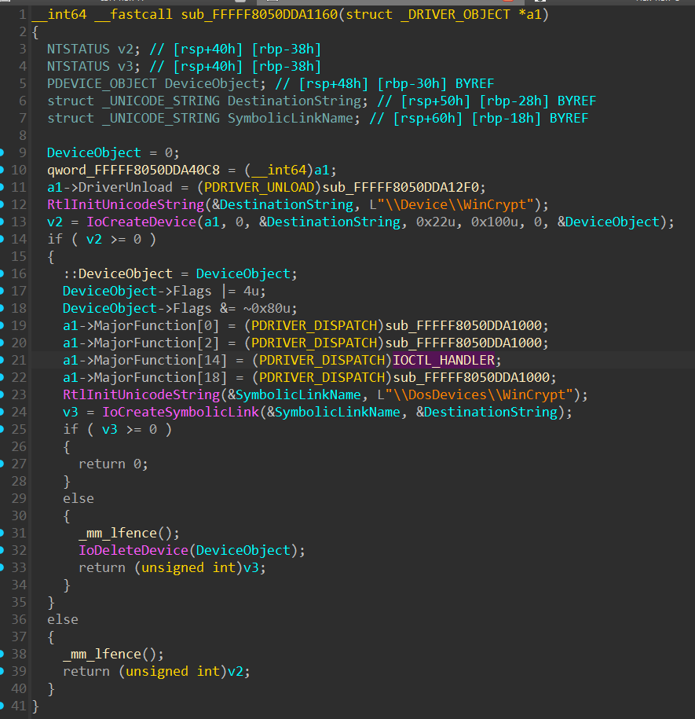

Видим достаточно мелкий драйвер и находим в нём обработчик IOCTL вызовов.
Заходим в обработчик и видим всего две ветки возможного поведения.

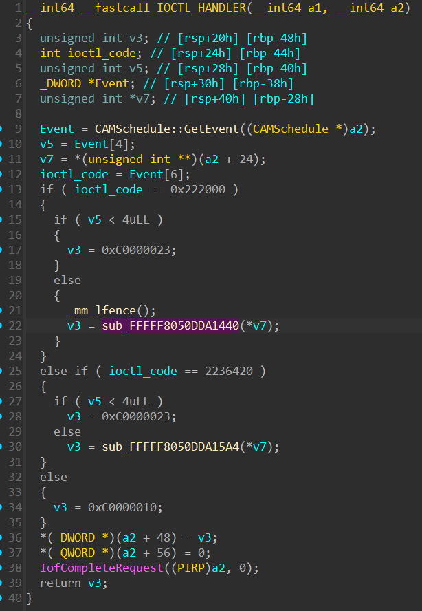

Заходим в функцию `sub_FFFFF8050DDA1440` и видим там ещё функцию а также функцию которая делает `memset`


Заходим в функцию `sub_FFFFF8050DDA1340` и видим там достаточно интересный код. По сути этот код достаёт нам нужный процесс из списка процессов.
То есть эта функцию вернёт нам указатель на структуру `_EPROCESS` некоторого искомого процесса.
После чего в функции выше мы обратимся к полям `ActiveProcessLinks` и `ImageFileName`.

Если немного изучить код дальше, то станет понятно, что этот драйвер прячет процесс через удаление его из двусвязного списка процессов и также зануления `ImageFileName`

На самом деле `volatility` умеет находить скрытые через удаление из двусвязного списка процессы с помощью встроенных плагинов. Однако если мы занулим ещё и поле `ImageFileName` то плагины перестанут нам показывать такие процессы потому что будут считать их невалидным, т.к. у них нулевое имя файла. Это достаточно интересная особенность которую я случайно обнаружил пытаясь лучше спрятать процесс от `volatility`. Не исключаю, что есть какие-то плагины или патчи которые позволяют избежать этой проблемы, но я про них не знаю и особо специально искать их не хотелось.

Так или иначе мы понимаем, что наш процесс попросту мог быть скрыт с помощью драйвера.

# Получение скрытого процесса

Теперь когда мы поняли, что наш процесс возможно скрыт, надо попробовать найти его. Это может быть немного нетривиально, т.к. у нас затирается `ImageFileName` который хорошо подсвечивает структуры `_EPROCESS` в памяти.

У меня родилась достаточно простая идея - убрать проверку на нулевое имя в структуре `_EPROCESS` в `volatility` и таким образом он начнёт парсить нулевые имена.

Эта проверка находится в файле `volatility3/framework/symbols/windows/extensions/__init__.py` в классе `EPROCESS`

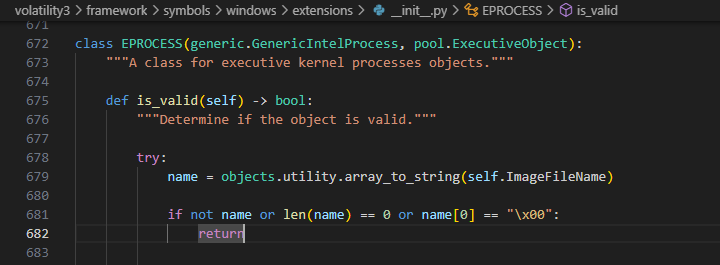

Просто закоментриуем её и попробуем получить список процессов ещё раз используя плагин `windows.psscan`

Мы получим прмерно такой же вывод как и при начальном сканировании, но теперь будут записи которые выглядят не совсем корректно:

```
4440    1208            0x615ab340      12      -       1       False   2025-10-03 06:47:27.000000 UTC  N/A     Disabled
109326067179852 16842752        �0�h��  0x61cf4dc6      1135607808      -       N/A     True    2015-06-12 00:33:53.000000 UTC  -       Disabled
82751134957568  0       ��C���  0x61cf4e46      3664773120      -       N/A     True    2015-06-11 22:16:27.000000 UTC  -       Disabled
0       0               0x639ac59e      2570059776      -       -       True    2015-06-11 19:12:47.000000 UTC  -       Disabled
17611513397252  455266533352            0x7ffa18919aa8  6553646 -       -       True    2025-09-30 15:59:14.000000 UTC  -       Disabled
2236    632     NisSrv.exe      0x7ffa20081300  5       -       0       False   2025-10-03 06:45:52.000000 UTC  N/A     Disabled
...
4440    1208            0xcd0501a08340  12      -       1       False   2025-10-03 06:47:27.000000 UTC  N/A     Disabled
```

Обратим внимание, что есть явно некорректные записи (огромный PID и PPID, сильно отличающийся OFFSET и время создания). Однако есть процесс с пустым именем который похож на настоящий.
Это PID 4440.

Предположим, что это как раз тот процесс который и был скрыт и запишем его смещение - 0xcd0501a08340

Воспользуемся `volshell.py` и посмотрим по этому адресу на байты которые должны быть на месте `ActiveProcessLinks` и `ImageFileName` там должно быть два одинаковых указателя и 15 нулевых байт соответственно.

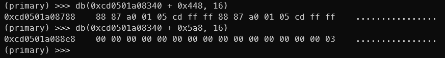

Пока что сходится, но всё ещё может быть false-positive. Поэтому надо попробовать сдампить этот процесс.

Для того чтобы сдампить скрытый процесс придётся тоже немного запатчить `volatility`.

Я сделал максимально топорные патчи в плагинах которые делают дампы. Суть в том, что я просто подставлю скрафченную руками структуру `_EPROCESS` по определённому смещению вместо реального процесса который укажу при дампе.

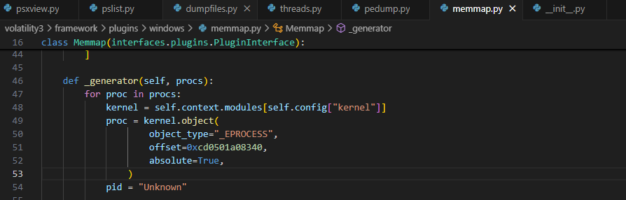

Я использовал плагин `windows.memmap` чтобы сдампить все участки памяти относящиеся к нашему подозрительному процессу.
Пишем команду и указываем любой валидный PID всё равно будет сдамплен наш процесс на который мы запатчили код

```
windows.memmap --pid 4 --dump
```

Получаем большой дамп всей памяти и всех сегментов.

# Изучение дампа скрытого процесса

Теперь надо разобраться в том, что было сдамплено. Я закинул дамп в IDA PRO и подождал пока пройдёт автоанализ.
В целом дожидаться полного автоанализа не обязательно, потому что довольно быстро можно заметить, что в начале дампа лежит много распозанных функций.

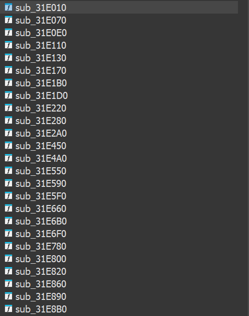

Немного протыкав функции подряд можно наткнуться на код который судя по всему дешифрует какие-то строчки в памяти.


По коду видно, что они просто XOR-ятся с константой 13. Посмотрим что это за строки.

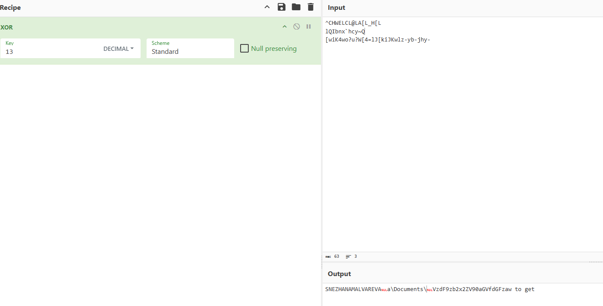

Получим какие-то пока что не очевидные значения, но среди них можно увидеть остаток какого-то пути `a\Documents` и другие строки. 
Можно немного изучить код и понять, что строки лежат в некоторой секции а декопилятор показал их не полность.

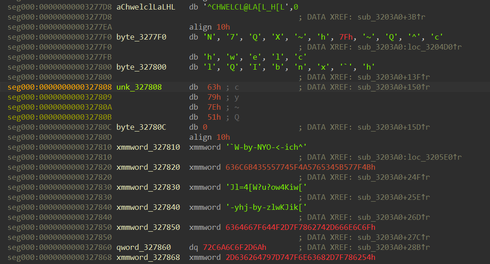

Попробуем вытащить эти строки и расширфровать.

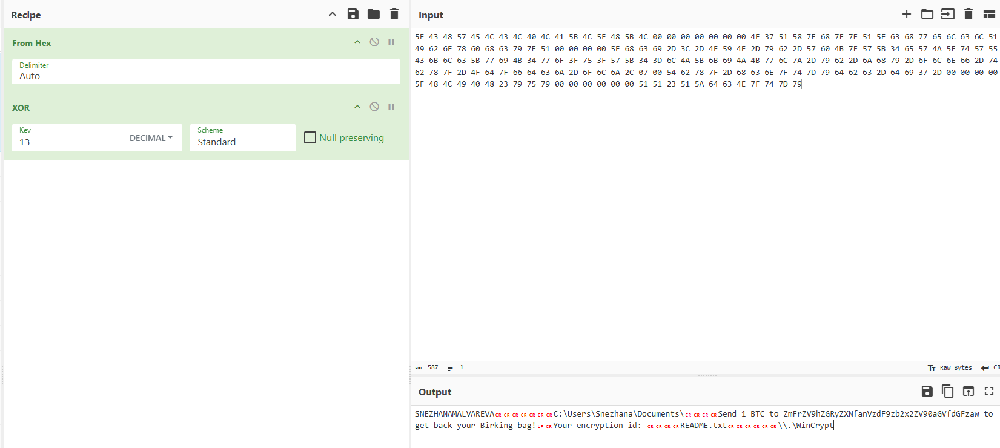

Отлично, кажется мы нашли именно тот код который нам и нужен.

# Исследование полезной нагрузки

Теперь нам надо понять как внедрён наш код и попытаться достать его.
Буквально чуть выше первой определённой функции из этого блока можно найти загловок PE файла.

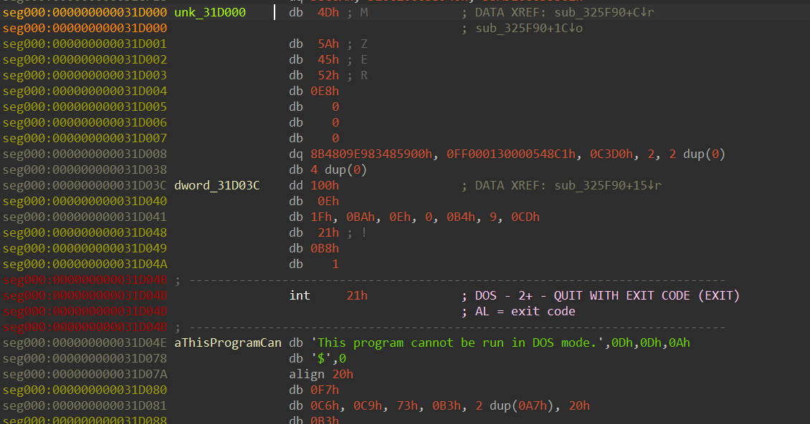

Этот заголовок интересен тем, что он модифицирован с помощью утилиты PE2shc которая позволяет перегнать PE файл в шеллкод и запустить его с 0 оффсета. Вот как выглядит этот код.

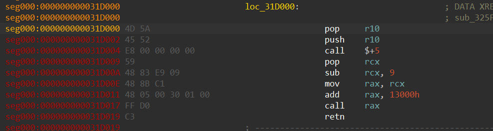

Нам нужно вырезать из нашего дампа этот участок и положить в отдельный файл. Сделаем это и получим полноценный PE который нормально загрузится в IDA PRO.

После небольшого анализа мы понимаем, что перед нами обыкновенный С++ бинарь который шифрует файлы.
При этом само шифрование очень простое, оно реализовано на WinAPI и повторить его не вызывает проблем.

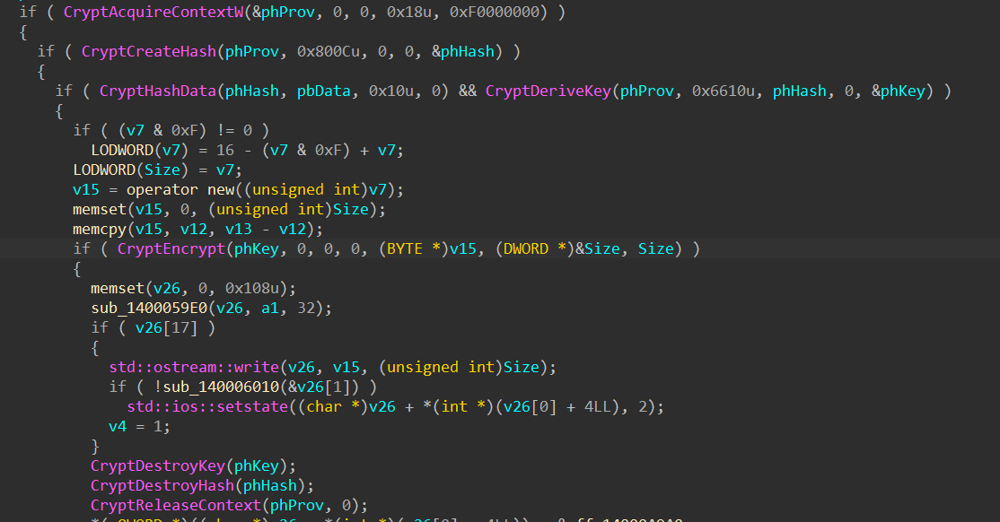

Однако надо понять от каких данных мы получаем ключ. В целом это можно сделать с помощью отладки. Не будем описывать здесь этот процесс.

Ключ из которого генерируются ключи для шифрования формируется на основе XOR-а двух блоков данных: константной строки "SNEZHANAMALVAREV" и первых 16 байт файла.
Т.к. у нас было зашифровано PNG мы можем предположить, что файл имеет стандарный заголовок и мы знаем первые 16 байт.

Осталось лишь понять как мы можем получить само зашифрованное изображение, потому что оно не дампится из памяти с помощью `volatility`.

Немного изучив код можно понять, что указатель на шифрованные данные не освобождается и просто висит в памяти. То есть память тоже доступна.
Мы можем зашифровать первые 16 байт PNG и взять зашифрованные 16 байт чтобы найти начало шифрованных данных. После чего скопировать их и расширфовать.

Код для расшифровки - [Source.cpp](./Source.cpp)
