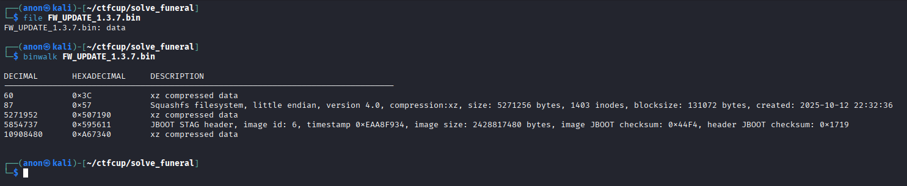
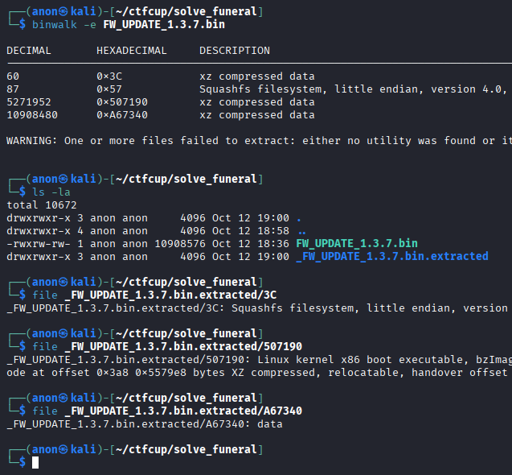
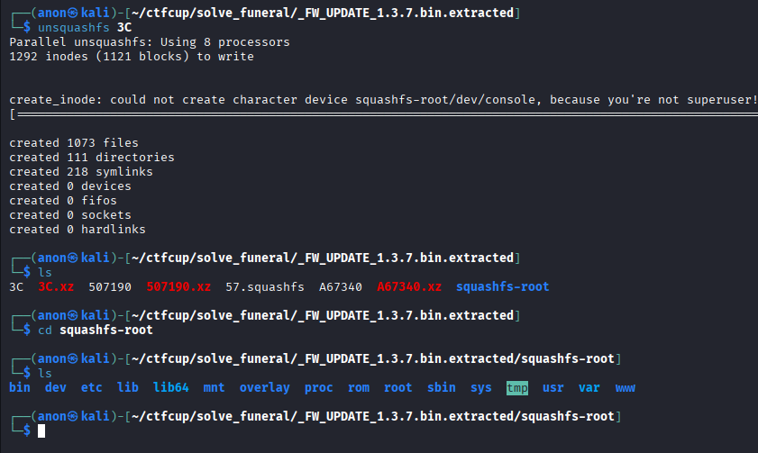
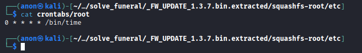
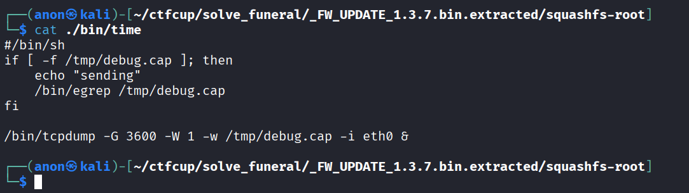
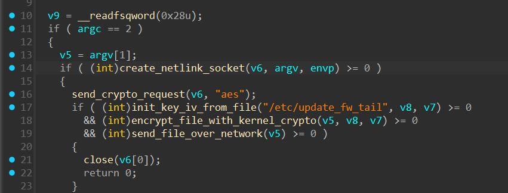

# Анализ файла обновления

Нам дан файл обновления прошивки. Мы можем изучить его заголовок и понять, что он кастомный.
Но можно и не делать этого, а просто запустить утилиту `binwalk` и увидеть три пожатых сегмента.

С помощью этой же утилиты можно распаковать эти участки.

Видим ядро и ФС, а также какой-то бинарный файл.

## Анализ ФС

Распаковываем файловую систему и изучаем её.

Изучаем различные места закрепления и находим команду в `crontab`

Смотрим на скрипт

Видим очень подозрительные команды. Из скрипта видно, что записывается дамп трафика на интерефейсе и каждый час мы запускаем утилиту `egrep`

Это довольно подозрительно, поэтому надо изучить что собой представляет `egrep`

## Анализ исполняемого файла /bin/egrep

Загружаем файл в IDA и видим, что ничего ревёрсить не надо так как все имена функций у нас есть.

Смотрим что делает код и понимаем, что он просто использует Linux Crypto API и шифрует файл с помощью AES-ECB на ключе который берётся из некоторого файла `/etc/update_fw_tail`
Здесь может быть не самый очевидный момент, т.к. этого файла нет в ФС. Но у нас просто статичная ФС, а прошивка может обновлять какие то файлы при установке.

Нам нужно вспомнить, что в конце нашего файла обновления находился некоторый странный файл. Нам нужно использовать его для получения ключа для шифрования.

Достаём ключ и расшифровываем трафик который шёл по UDP на порт 1337 на сервер `133.7.133.7`

Расшифровываем трафик и получаем ещё одни дамп в котором отправляется картинка в открытом виде.

Достаём картинку и на ней написан флаг.

Скрипт для расшифровки - [скрипт](./decrypt.py)
