# Начальный анализ

Судя по названию и расширению файла нам дана пользовательская ветка реестра.

Используем Registry Explorer и начинаем анализ реестра.

Находим там строку которая прописана в автозапуск - Software\Microsoft\Windows\CurrentVersion\Group Policy\Scripts\Logon

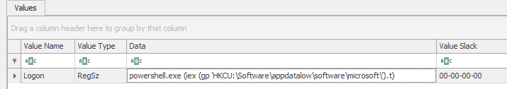

Далее находим нужную ветку реестра откуда идёт запуск нашего PowerShell кода - Software\appdatalow\software\microsoft\t

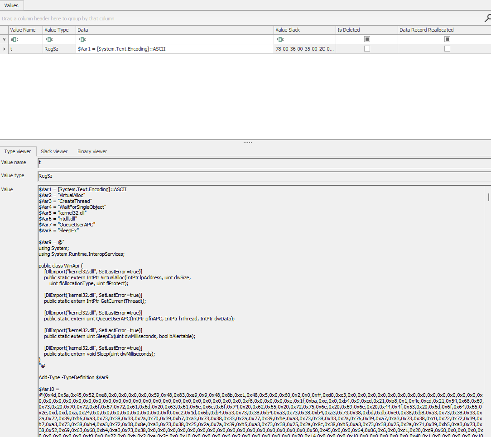

Достаём скрипт и видим, что внутри лежит огромный блоб который инжектится в процесс и передаёт управление. Вытащим этот блоб и закинем в IDA PRO.

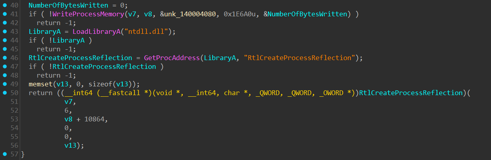

Видим в коде инжект в процесс `explorer.exe` и передачу управление через `CreateProcessReflection` по указателю и смещению +10864 (0x2a70)

# Анализ основной полезной нагрузки

Дампим блоб который инжектится в процесс и тоже закидываем его в IDA PRO.


Он загружается как обычный бинарный блоб, но в нём явно прослеживается код. Переходим на точку входа, а именно функцию sub_2a70.

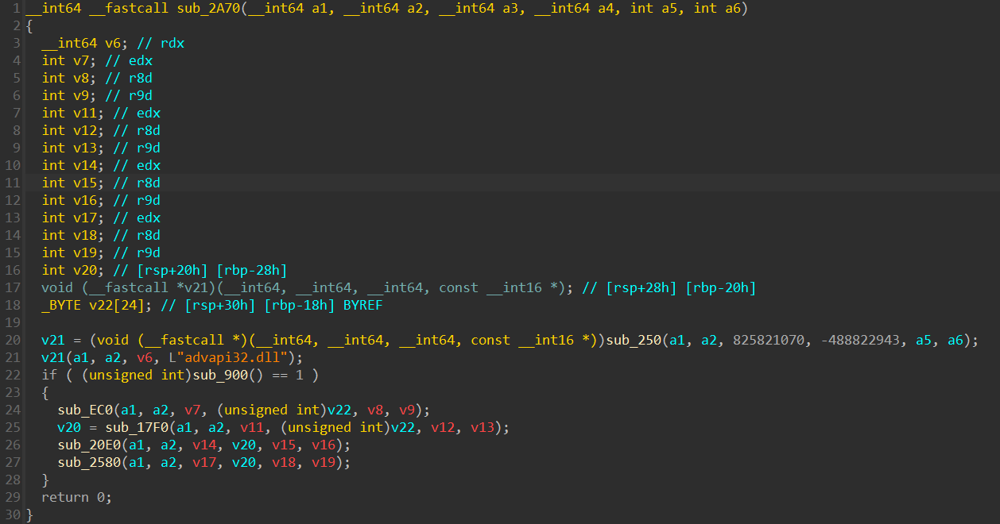

Здесь мы видим сильно побитый код, у него несовсем верно определены конвенции вызова и количество аргументов функций. 
Потребуется потратить некоторое время на ревёрс ряда функций чтобы понять, что происходит.

## Получение функций по хэшам

Первое что нужно понять это как получаются указатели на функции которые вызываются. Для этого используется техника поиска в уже подгруженных модулях необходимых функций по хэшам.
Это довольно стандартный и популярный метод скрыть какие именно функции будут использованы и немного замедлить статический анализ.
Немного преобразим функцию sub_250 которая на самом деле достаёт из нужного модуля нужную функцию и получим примерно такое.

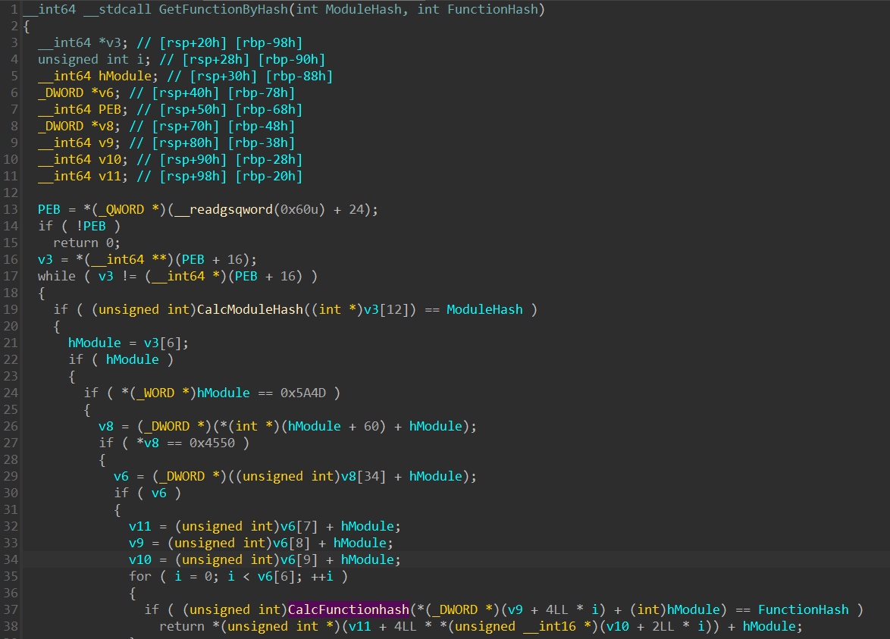

В целом можно добавить стандартные структуры Windows и всё встанет на свои места, но если вы уже видели такую технику, то это не обязательно, так как понятно, что нам надо просто забрать функции и посчитать все возможные хэши.

Наши функции получения хэша от строки выглядят так:

```
DWORD HashStringA(LPCSTR String) {
    DWORD Hash = 0xDEADBEEF;

    for (int i = 0; *String; String++, i++) {
        Hash = (Hash << 7) | (Hash >> 25);
        Hash ^= (Hash << 3) + (*String * 0x1F3F5A7B) ^ (i * 0x0C9E5D37);

        Hash = (Hash & 0xAAAAAAAA) >> 1 | (Hash & 0x55555555) << 1;
        Hash = ((Hash << 5) * 0x67F4A7CD) | (Hash >> 3);
    }

    Hash ^= Hash << 13;
    Hash ^= Hash >> 7;
    Hash ^= Hash << 5;
    return Hash;
}

DWORD HashStringW(LPCWSTR String) {
    DWORD Hash = 0x8BADF00D;

    for (int i = 0; *String; String++, i++) {
        Hash = (Hash << 11) | (Hash >> 21);
        Hash ^= (Hash << 7) + (*String * 0x4E6F2A5D) ^ (i * 0x3B2A7C1F);

        Hash = (Hash & 0xCCCCCCCC) >> 2 | (Hash & 0x33333333) << 2;
        Hash = ((Hash << 9) * 0x2D5A6E39) | (Hash >> 1);
    }

    Hash ^= Hash << 17;
    Hash ^= Hash >> 11;
    Hash ^= Hash << 3;
    return Hash;
}
```

Прогоняем через них стандартные библиотеки с их функциями и начинаем размечать код.

## Анализ main
Начинаем смотреть код дальше и видим первую же функцию в условном main которая должна вернуть 1 иначе мы просто выходим.
Анализируем её.

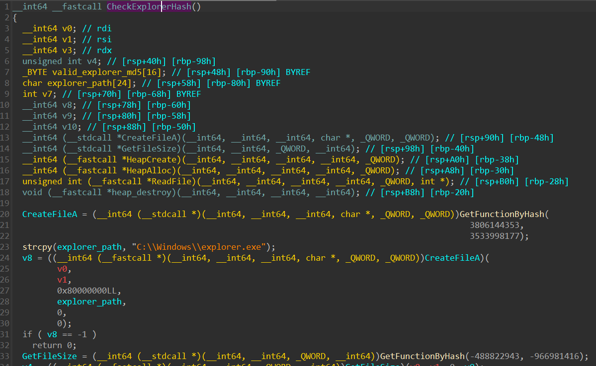

Первое что она делает это открывает и читает файл `explorer.exe` в буфер.
После чего вычисляет от этого буфера MD5 и сравнивает с прошитым.

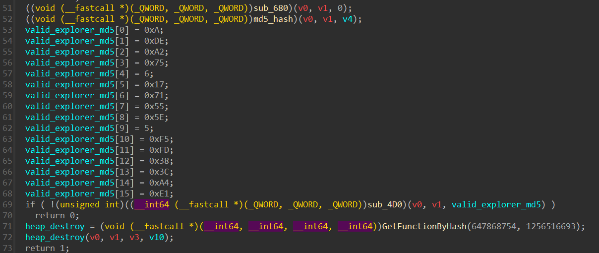

Мы можем найти этот бинарь на сайте - [https://winbindex.m417z.com/](https://winbindex.m417z.com/) и скачать его, т.к. он немного понадобится дальше.
Хэш `explorer.exe` - `0ADEA275061771555E05F5FD383CA4E1`

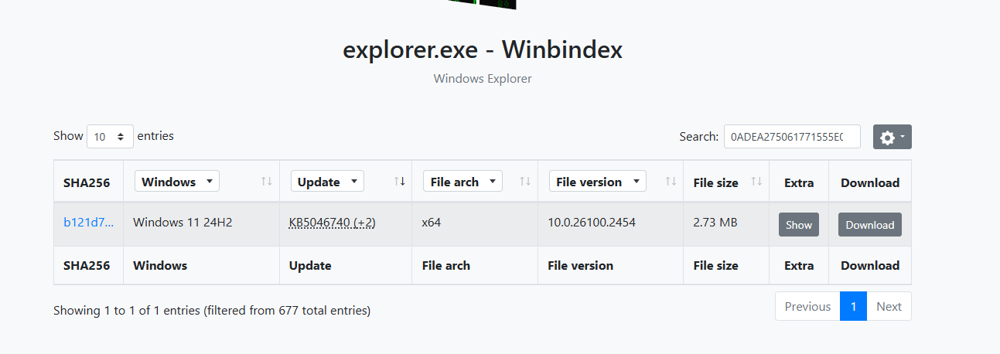

Если всё корректно, то мы продолжаем выполнение программы.

Следующая функция которую мы видим как раз использует некоторые указатели из `explorer.exe` и если восстановить их то можно будет понять, что эта функция достаёт 3 значения из SID-а и кладёт их в массив переданный в качестве аргумента.

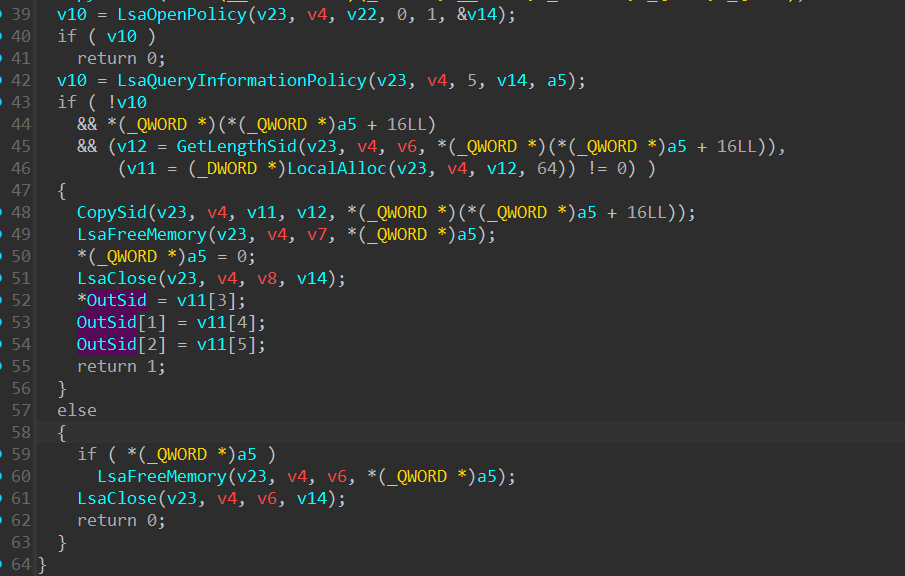

Эти значения по факту играют основную роль в дальнейщей работе кода. Они позволяет расшифровать конфиг, подключиться к серверу и прочее.

Анализируя следующую функцию мы видим расшифровку некоторого блока на основе наших данных из прошлой функции.

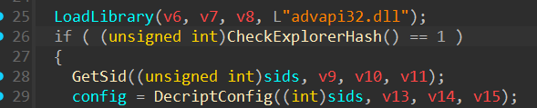

Внутри функции нас ждёт алгоритм преобразования наших 3 32-битных значений в 16 байт ключа для RC4

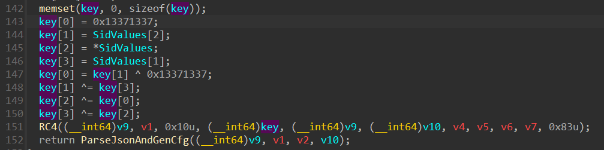

## Расшифровка конфига

Так как мы можем узнать SID из реестра который нам дан, то мы можем получить и ключ.

Значения SID: 3410722941 626264653 1176092544
Значение ключа для RC4: b7ac2e55cdb54d63ca2c659e872631bb

Расшифровываем конфиг 

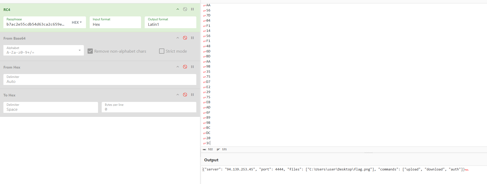

Видим адрес сервера, порт, доступные команды и файлы которые надо зашифровать.

## Шифрование файлов

Анализируем код дальше и находим функцию которая шифрует файлы. 

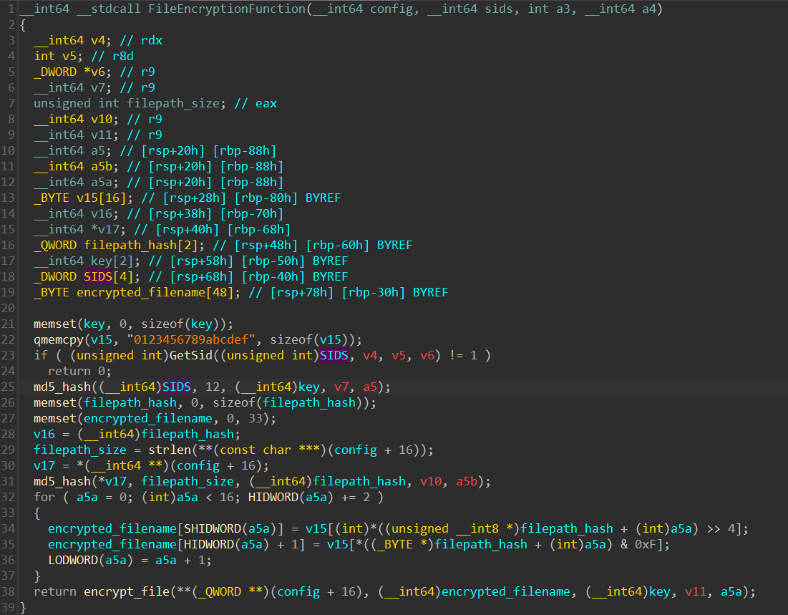

Как мы видим опять используется SID для получения ключа. На этот раз от него берётся MD5.
Также имя файла изменяется, это md5 от полного пути до файла.

Смотрим функцию которая непосредственно шифрует блоки.


Надо сделать обратную функцию для этой.

```c
void decrypt(const uint8_t* key, const uint8_t* input, uint8_t* output, size_t data_len) {
	for (size_t pos = 0; pos < data_len; pos++) {
		uint8_t byte = input[pos];
		
		byte ^= ((pos * 0x5A827999) >> 8) & 0xFF;
		
		byte ^= key[(pos + 7) % 16] ^ (pos & 0xFF);
		
		byte ^= 0xAA;
		byte = ((byte >> 3) | (byte << 5));
		
		uint8_t rot_amount = (pos + key[pos % 16]) & 7;
		byte = ((byte >> rot_amount) | (byte << (8 - rot_amount)));
		
		byte ^= key[pos % 16];
		
		output[pos] = byte;
	}
}
```

## Сетевой модуль

Так как SID мы знаем, то мы можем и сгенерировать ключ для шифрования файла. Осталось понять как достать файл с сервера. Имя файла мы знаем, но пока не знаем как подключаться к серверу.
Это мы выясним в последеней функции нашего шеллкода.

В функции мы видим довольно сильно поехавшие ссылки, это из-за того, что в наш шеллкод в конец подставлен большой блоб с сетевым клиентом в виде PE2shellcode бинаря. Мы можем вытащить его отдельно.

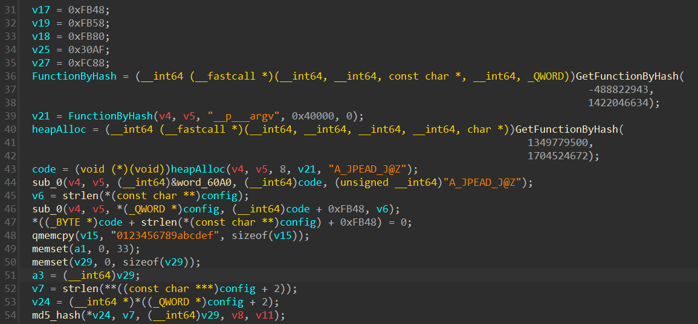

В этом же коде происходит патч нашего сетевого клиента, т.к. в нём по сути нет корректных данных таких как IP, PORT, имя файла и авторизационных хэш, а также ключ для шифрования трафика.

Вытаскиваем наш клиент для сети и загружаем в IDA PRO.

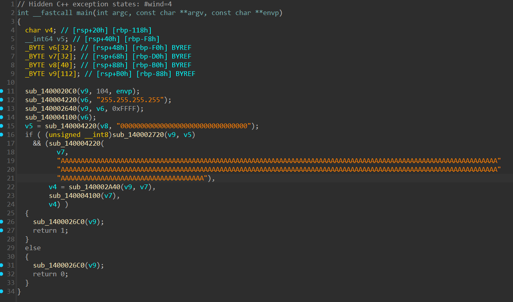

Здесь у нас стандартный С++ бинарь под Windows без символов, в целом его анализ сложности предоставлять не должен. Можем заметить, что строки обозначающие IP адрес или имя файла забиты мусором, это потому что наш шеллкод должен их запатчить.

Анализируем код и понимаем следующее:
- Клиент коннектится к серверу и отправляет сообщение вида `{'cmd':'auth', 'hash':<val>}` при этом оно шифруется и кодируется в base64.
- Загрузка файлов происходит похожей командой

Теперь нам осталось понять лишь как получить авторизационный хэш.

Его генерация находится в коде патчера. Находим смещение куда мы патчим хэш и находим функцию где генерируется значение которым патчим место в сетевом коде.

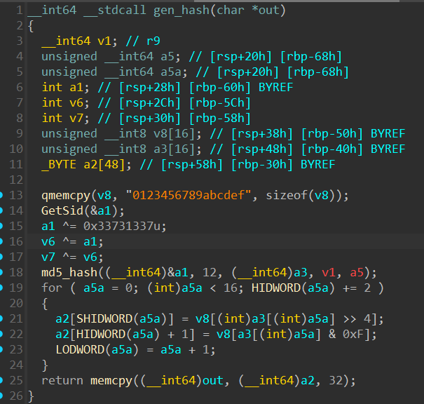

Всё опять на основе SID-а, а значит мы можем это восстановить.

Теперь осталось соединить всё воедино, а именно:
    - реализовать клиент подключения и скачивания файла
    - скачать файл
    - расширфовать файл

Скрипт для скачивания файла [client.py](./client.py)
Скрипт для расшифровки файла [decrypt_file.py](./decypt_file.py)
